<p align="center"></p>
<h1 align="center">The Civilization Engine</h1>
<p align="center"><strong>A bottom-up simulation of how people build a civilization.</strong></p>
<p align="center">Individuals make a living, form families, trade, learn, build and adapt. Their choices can grow settlements into cities and shape the societies around them.</p>

<p align="center">
  <a href="#the-project">Project</a> · <a href="#current-build">Current build</a> · <a href="#technical-overview">Technical overview</a> · <a href="#run-it">Run it</a> · <a href="#documentation">Documentation</a>
</p>
<p align="center">
  
  
  
</p>

## The project

The Civilization Engine (TCE) is a single-player simulation project about societies that grow from the everyday decisions of their people. Its long-term scope runs from early settlements to modern civilization. The guiding rule is **the engine authors the vocabulary, never the plot**: people act within a world of authored rules and possibilities; the simulation does not force a historical storyline or predetermined outcomes.

The project is actively developed. The working build is a Rust simulation viewed through a local web observer. It currently models an early farming village; modern civilization is a long-term goal, not an implemented feature. Unreal Engine support is planned, with the kernel's C interface in place and the Unreal client still to be built.

**The M3a demo** lived one seed (2, the river valley) under each property regime, three runs each, since runs differ. A band of 40 lived ten years under both, and the regimes did not part: at the tenth year's end 47–51 people in 12 households, Ginis of goods 0.15–0.19 against 0.16–0.18 and of floor area 0.21–0.22 in both, 27–28 m² a house, the same prices (a sickle 3.6–4.4 hours of work), and no money. Only what tenure itself writes differed: under village fields the village held all 18 ha and no household held any, and under household fields a field was now and then let. With land plentiful, every household works what it needs under either rule. A village of hundreds (a band of 125 joined by 20 families, about 250 people by its fifth year) parted only in a famine. In its sixth year a harvest some 40% short brought hunger under both regimes. Under village fields 82–105 people died and few households left, so 154–175 were still there at the year's end, with goods more unequal (Gini 0.27–0.32). Under household fields 25–73 died but households left sooner (up to 229 people), leaving 12–189, with Ginis of 0.11–0.24, and up to 38 fields let for a share of the grain. In the seventh year every household of every run left the valley. The decision log has the numbers and two NUDGEs: the regimes part only under scarcity, and a village of hundreds made at once does not survive its first bad harvest.

**Milestone M3c, Seasons and time, is implemented** ([plan §7](PROJECT_PLAN.md#7-milestones)), in five slices: the speeds and the day step, the fifty-year dashboard, weather and seasons, soils and fertility, and Accelerated mode's approximations with their consistency test. Each world lives its own weather, day by day; each field's water sets its harvest, and its soil remembers how it was cropped, rested and manured. The Accelerated speeds (60×, 600×, Max) live a day at a time, a village about 23 % faster than by the minute, with two declared approximations held to Detailed mode's results by a statistical test. **The M3c demo** lived one village through a dry year and a wet one: in the dry year its harvest halved, its grain stores fell and grain was asked about a fifth dearer, and nobody went short; then five worlds lived fifty years in Accelerated mode, and the sanity dashboard passed, four rows green and the Gini of goods amber (hoe farmers with land to spare are this equal). See [plan §9](PROJECT_PLAN.md#9-decision-log) for the runs.

**Milestone M4, Councils, law and crime, is designed and being built** ([plan §7](PROJECT_PLAN.md#7-milestones)). It is split in three. **M4a, standing and the first council, is implemented**, its fifty-year dashboard passing on its last build: villages of 1,000 to 2,000 people at Max; people who remember what others did for them, and standing that differs by who is asked ([ADR-0014](decisions/0014-ties-standing-notables.md)); and a polity per settlement that starts from a gathering of its adults, where offices, laws, a common store and relief arise only if people propose and back them ([ADR-0013](decisions/0013-polity-offices-laws.md)). **M4b, crime and order, is implemented** ([ADR-0015](decisions/0015-incidents-cases-obligations.md): what happened, what the polity knows and what people believe kept apart; every sanction an obligation): theft and what was seen, cases and their decision, the watch and corruption, and curfews, with the dashboard's crime row and the M4b demo; closures of a place are designed and not built. **M4c, factions and unrest**, is designed and being built ([ADR-0016](decisions/0016-grievances-claims-opinions.md): grievances, news and opinion held per person and sourced; [ADR-0017](decisions/0017-factions-episodes-regime-change.md): factions, episodes and changes of regime), in six slices: claims and grievances, amending the custom, opinion and norms, factions and episodes, seizure and founding, and the god tools with the regimes row and the M4 demo. **Its first five slices are implemented (bar keeping a seized store and damage to property); of the sixth, the god tools with the regimes row and the M4 demo, the whisper and an ideology heard of are implemented, and the agitator, blessings and curses, the regimes row and the demo remain.** Claims and grievances: a gathering is heard of by word of mouth and only those who heard come; people hold grievances against the gathering, an office or a household where the polity's acts harm them against a law they know, tell them at the hearth, and the inspector shows them with what each person has heard. Amending the custom: someone a gathering overruled may propose changing who belongs to the body (all adults, household elders, landholders), how many must come or how it decides, one change at a time, judged by how the new rule would have decided what they saw; the present custom decides it, and the Government panel keeps every version of the custom with the amendment that made it. Beyond opening that move to those who hold one against the gathering, grievances act through factions (below). Opinion: each adult holds a position on the questions of the day, anchored in their household's lot and moved a little by talk at the hearth, and talk weighs in their stance at a gathering. Norms: everyone holds their own measure of the norm that what the gathering decides binds, and their own belief of how many households pay their levy, learned only from what companions say their own household did; both weigh in whether they pay a levy or keep a curfew. Values: everyone holds a few values (safety from want and harm, a household's say over what is its own, giving back what was given or taken) more or less than most, from birth and like their parents; what a law does to them weighs beside their household's lot in where they stand, how they stand at a gathering and whether they propose it. Ideologies: some founders bring an idea of what is wrong and what should be done (common provision against lean years; order kept by all; each household its own), children take up their parents', and companions at the hearth take one up from a holder they trust when it fits what they hold dear; when the problem it explains is before the village, a holder weighs the laws it proposes, and a law so proposed keeps the creed in its record. **The fourth slice, factions and episodes:** factions, petitions and refusals of a levy are implemented. Someone who feels a grievance against the gathering or an office keenly, and has heard that others they trust hold one too, may found a faction; each adult reviews monthly whether to join or stay, for reasons the inspector shows; members' households give dues from each threshing to its store, up to a reserve, and it gives to a member's household short of food. A faction's organizer may call a petition at the hearth for what answers the party its members blame (the common store at another share or none, or another keeper in place of the one in office); those who heard of it choose whether to come, the gathering decides what it asks as any law, and a petition turned down is a new grievance to each who came. The Government panel lists each polity's petitions. Where no petition can be called, an organizer may call on its members to keep back the store's levy together, openly; each who heard of it weighs joining it at their threshing, and the law records levies kept back in a refusal apart from those kept back unannounced. Assemblies with other demands are designed and not built; damage and violence come with slice AI's first office of force, since violence answers encounters and nobody yet collects, disperses or represses. **The fifth slice, seizure and founding, is implemented.** Revolts: a faction whose members blame the gathering holds a program, the body under which the decisions its members saw would have gone most their way. Where it can call neither a petition nor a refusal, its organizer may call on everyone to stand with that body in place of the gathering's, which breaks the custom itself and so weighs against the norm that the gathering binds. Each adult who heard of it chooses each day to stand with it, with the gathering or with neither, from their grievance, their regard for its organizer and where those they know stood the day before; it holds once the keeper and the watch, and more adults than stand with the gathering, have stood with it a week, and the body becomes its program, a version of the custom taken rather than amended. The Government panel lists each polity's revolts and says how each version of the custom came about. Founding follows: for three months the new body, every member of it weighing, may propose an end to each law the old custom made (a store's levy at none, or any other law repealed), each household weighing an end as what the law would have brought it, turned about; what the body leaves stands. A watch may now have several keepers, each guarding what the others leave unguarded, and where it is several, one of them who holds a grievance against the gathering may call on the others to take the deciding for the watch: the watchers alone take sides, each day, from their grievance, their regard for the one who called it and where the others stood, and if more back it than the gathering for a week, those who keep the watch decide from then on, and a founding follows. Force is the last of it: where a household refused what a gathering's finding owed, one who keeps the watch may go to take it; each adult of the household lets it be taken, stands in the way, or strikes, each by their own choice, and where any resisted the watcher takes it by force or turns back. Every blow is recorded (who struck whom, under which finding, and how long it kept them from work, or that it killed them), a blow keeps the one struck from work, a death by one is a death by violence, and the takings panel tells each encounter in plain words. Keeping a seized store and damage to property are designed and not built. **The sixth slice, the god tools, has begun.** The observer may whisper to an adult a true claim their settlement's word holds that they have not heard (a gathering or a petition called, a refusal or a revolt declared, another's grievance), placed in their hearing from no one; what they do with it is what anyone who heard it would do. The observer may tell an adult of an ideology; they weigh it by how well it fits what they hold dear, by a draw that telling them again never makes anew, and again at their reviews while it is fresh. Each use is one record, logged in the chronicle as one recorded influence; a repeat refreshes it and adds nothing; and the inspector says what came of each, read from what people did. What M4a built: the speed work for 1,000–2,000 people (exact, about a fifth faster; a year of 1,000 people at Max takes about eight minutes), and ties and standing. People remember what they saw one another do (gifts, wages, rent, trades, teaching, company at the hearth); once a month each settlement's standing is summed from those memories and its notables named, and a household short of food asks those its members regard before strangers. The inspector lists whom someone knows best and why, and a Standing panel shows each settlement's notables. The first council (slice Z): each settlement has a polity that starts from a gathering of its adults. When food will not last, its notables and the elders of the households going short weigh proposing a common store. A gathering at the hearth decides by acclamation, a levy is paid or kept back at threshing as each thresher chooses, and a household short of food may ask the store. Every law's history is kept: who proposed it and why, who came and where each stood, how it was decided, who knows it, and what was paid, kept back and given. A Government panel shows each settlement's custom, its store and every law with that history, in the kernel's words. A household out of food now weighs leaving against what staying offers: its own food, what neighbours could spare, the common store if it knows of one, and the harvest its fields should bring. The first office is a storekeeper, named by a law the gathering passes: the store spoils as a roofed store under the keeper's roof and relief is asked at their home, and when the keeper dies or leaves the law lapses and a new one must be proposed. Each polity is labelled from its history by a pure classifier that nothing in the world reads ("Council community: a storekeeper's office; its levy mostly paid"), with its reasons. The notables' tier is held by its own gate to what every adult deliberating would do, and a sponsor remembers how a gathering they came to voted. The M4a demo lives one village through its lean seasons: who proposed what and why, who backed it, what was decided and what moved through its store.

**Milestone M3b, Knowledge and building, is implemented** ([plan §7](PROJECT_PLAN.md#7-milestones)), in six slices: knowledge carried by people, discovery, frame buildings and storage, building wear and upkeep, structural failures, village-level caution that makes later frame buildings stronger after failures, deposits and earthworks, and style copied from admired buildings. Every world now lays down deposits of clay, stone and flint as bodies in the ground, from its seed; villages find those that show where their people walk, and the observer sees them all on the map and can lay one down. Households now level a sloping plot before they build on it, cutting and filling the ground, and the world keeps what they moved; the observer sees each levelled plot and the ground as it was left. Households also dig clay from pits at deposits their village knows, heaping the spoil beside each pit, and make storage pots of it that keep their grain and flour as a raised floor does. Every building's daub is dug from a pit beside it, and once the loose stone and flint near a village run short its people quarry stone and dig flint at deposits they know. Households build clay ovens and bake in them, and cob walls are deferred to a mass-wall grammar. Each band builds in its own way and each household to its own taste, and once a year households' taste moves toward the new buildings their village admires; the observer reads how each building was built and which it followed. The six slices are: **M** knowledge carried by people (what each person knows, learning from upbringing and by working beside someone who knows, a craft lost with its last knower, the god tool *introduce a technology*); **N** discovery by named people and the first new crafts; **O** grammar v2 (rectangular houses, storehouses and workshops in bays, lofts, raised floors and two storeys, storage as a roofed capacity); **P** structural rules (decay from exposure, upkeep, loaded lofts that sag and fail, collapses, and builders who over-build after a failure); **Q** deposits and earthworks (clay, stone and flint, levelled plots, pits and quarries, the god tool *place a deposit*); and **R** style copied from admired houses, with the demo. Knowledge follows [ADR-0008](decisions/0008-knowledge-carried-by-people.md), buildings [ADR-0009](decisions/0009-building-components.md) and the ground [ADR-0010](decisions/0010-ground-people-change.md).

- **Slice M (implemented):** knowledge carried by people ([ADR-0008](decisions/0008-knowledge-carried-by-people.md)). Work now needs know-how. Each farming, making and building job needs a *technique*, a new content kind: growing emmer, knapping sickle blades, shaping wood, shaping stone, pounding grain, grinding at a quern, baking flatbread and building roundhouses.
  - **What a person knows.** Each person keeps what they know, what they are learning (hours toward it) and what they have only heard of, with how and from whom it came. Founders bring what the people profile gives them.
  - **Learning.** Children learn their household's work as they reach its age (work first done only once grown, such as making an axe, in the year before growing up). Someone who does not know a craft learns it only by working beside someone who knows it and is at that work, a few learners to a teacher. The teacher is a member of their household, or an owner of the workshop that hired them.
  - **Loss.** A technique is lost in a settlement when the last person there who knew it dies or leaves, and the chronicle says so. Each settlement keeps a record of when it came to know each technique and when it lost one.
  - **The god tool *introduce a technique*.** The observer can give someone a technique outright, or let them only hear of it.
  - **The observer.** The **Knowledge** panel lists each settlement's techniques: who knows each (eldest first), who is learning it, who has heard of it, how many practised it in the last year, and its history. The inspector says what someone knows and holds the introduce tool.
  - **No change yet in behaviour.** In the core content every founder brings every technique, and children learn every one at home. So slice M leaves behaviour exactly as it was: a test loads one save with and without the techniques, and both live the same 120 days (and, in a longer check, the same ten years). Crafts worked out by named people arrive with slice N.

- **Slice N (implemented):** discovery and the first new crafts (ADR-0008 §3).
  - **Finds.** People can now work out techniques nobody taught them, as named finders. Routine work counts 1 % of its hours as experiment toward the techniques its practice can find (research 07-01 §2.3). A new behaviour, **trying something new**, spends an hour at home at most once a week trying toward the technique that would answer a household problem. Each session ends in a draw against the chance its hours find the technique (1 − exp(−ln 2 · hours / E50)), keyed by person, technique and session. A find needs a known route of the technique's prerequisites and the goods it needs at home. The finder knows it at once. The chronicle says whether it is the first anyone has made, the first here, a find of what others here already knew, or of what was lost here before.
  - **The first problem.** The first problem people try at is food that will spoil before it is eaten, worked out from what a household holds and eats.
  - **Drying and smoking.** It answers that problem. Meat and fish are dried over a slow fire into dried meat and fish that keep for months. Drying takes water, not calories. A household that knows it dries what would otherwise spoil.
  - **The rotary quern.** It grinds in half the time of a saddle quern (research 08-03 §2.1). A far technique: half of those trying would need 100,000 hours to find it, so in practice it comes from elsewhere, as the observer's introduction. Its household then makes one and grinds with it.
  - **Tools for known work only.** A household wants a tool only for work someone in it knows how to do.
  - **Rare in ordinary worlds.** Meat and fish rarely spoil in today's villages, since a kill is shared out in plenty and fish are caught a little at a time. So the try behaviour is mostly silent and finds are rare (see the decision log for the ten-year smoke). Tests show the whole path in a set-up world.

- **Slice O, first step (implemented):** grammar v2's vocabulary ([ADR-0009](decisions/0009-building-components.md) §1–3). Households do not build any of it yet.
  - **The frame grammar.** A second grammar sits beside the frozen hut: rectangular post-framed buildings of equal bays at a constant width under a gabled thatched roof, of one or two storeys, with lofts over chosen bays and floors raised on posts. A design expands into its parts stage by stage, and also yields:
    - its spaces (each level's bays, floor and use) and its floor by use;
    - sleeping places, storage capacity in kilograms (on a raised floor, in lofts, on other floors) and places to work;
    - 8 to 32 component groups (posts of a wall line, tie beams, a loft's joists, a bay's roof frame, the covering, a wall's infill), each with its members' count, section, span, spacing and the area it carries.
  - **What it costs.** Timber is costed from the members' sizes, so deeper joists take more wood, and the roof's area is its projection over the cosine of its pitch (research 11-04 §2.2–2.3). A three-bay house of 7.5 by 5 m with a loft over one bay takes about 940 hours to build, 2.1 t of timber and boards and 2.2 t of thatch.
  - **Stable ids.** Part and group ids name level, bay, kind and index, so a design with one more bay keeps every id it had. Golden hashes pin four designs, and the hut's hash is unchanged.
  - **Programs.** Content programs now say what they are for: the hut (a dwelling) and three frame programs, a longhouse (a dwelling), a raised granary (a store) and a workshop. The frame programs need a new technique, jointed timber framing, which nobody knows and nothing finds yet; only the observer can introduce it. Households still design huts. Choosing among programs, storage by capacity, and storehouses and workshops of their own come with the rest of slice O.
  - **Saves and the boundary.** Saves schema 15 adds rectangular footprints, sixteen parameters a design and plots for stores and workshops. Wire 1.14 adds a building's grammar, use, size, bays, lofts, gabled roof and ridge, floor by use, storage and places to work. Content API 11.
  - **The observer** draws a frame building's turned walls, posts and gabled roof with its ridge, stage by stage, and its readout names the bays, lofts and floor by use. The marks it draws are worked out by a pure function and unit tested. A world has frame buildings only once the observer introduces jointed framing to a household that needs more than a hut.

- **Slice O, second step (implemented):** homes chosen among programs, and storage as room under a roof.
  - **Choosing a home.** The people profile lists the homes a household may build: a hut or a longhouse. A household builds one that someone in it knows how to build, choosing the design that covers its members and its goods for the fewest hours of work. Its means then buy more floor in the same program: more bays, lofts or a second storey in a longhouse, or a larger hut. More means never give less floor. For five people a hut is cheaper, so founders, who know only huts, build huts as before.
  - **Bays win when a hut cannot do.** A household of twelve outgrows the largest hut. A household with more grain than a hut has room for builds bays, with lofts over enough of them, since a loft is cheaper room for goods than a bay. Introducing jointed framing to a household with grain to keep shows it: it builds a longhouse with lofts.
  - **Room under a roof.** Goods that keep better under a roof (grain, flour, provisions, dried meat and fish) now take room there: lofts, floors and raised stores' floors, each holding so many kilograms a square metre. The goods that gain most from a roof take the room first. What does not fit spoils as in the open. On a raised store's floor goods keep twice as long, and a hut's floor holds 100 kg a square metre. That figure comes from probing ordinary villages, whose households held at most 83 kg/m², so in today's villages storage rarely binds and M3a's calibration holds.
  - **The observer** says what each building holds: "loft over 1 bay: 1.2 t of 1.9 t, mostly grain". Wire 1.15, content API 12.

- **Slice O, third step (implemented):** second buildings beside a home, storehouses and workshops ([ADR-0009](decisions/0009-building-components.md) §7).
  - **One project at a time.** A household builds one thing at a time: what it has under way and can work on, else its first home, else a storehouse if one is worth it, else a workshop for each firm that needs one, busiest first, else a larger home if its means pay for all of one. It begins the first of these it can pay for and find ground for. A building nobody in the household can work on any more (its technique forgotten) waits, and holds nothing else up.
  - **A storehouse when goods are being lost.** The people profile now lists a granary among what households may build. A household that knows jointed framing builds one beside its home, within 30 m and its door toward the house, when the goods its roofs have no room for would lose more in the open over three years than the granary costs in hours, and its means and time pay for all of it. A tonne beyond the roof is not worth one; eight are. A household whose goods beyond the roof are seed it keeps has nothing to spare, and builds none. Its roof is wanted before the harvest.
  - **Raised goods keep.** Grain on a granary's raised floor loses about 2.5 % a year, against 16 % in the open. A store's or a workshop's roof never moves a household's home.
  - **A workshop when more work at once than a home holds.** A firm counts the most people working for it at once lately, owners and hired hands. When that is more than a home has room for (two), and its household knows jointed framing, it builds a workshop for the firm with places for them all, if its means pay for all of it. A firm alone is no reason to build: one with two at work builds nothing.
  - **The firm moves in.** Once the workshop's roof is on, its owners walk there to make what it sells and the hands it hires walk there too; its stock is still kept and sold at their home. A closed firm's building stays, and by the next day it goes to the household's oldest open firm that has none. A firm that outgrows its workshop stays in it. Heirs take every building.
  - **Wealth beside the house.** The wealth measures keep house floor area for homes, and add each household's floor under all its roofs and its room for goods. Saves schema 16, wire 1.16, content API 14.
  - **The observer** names a raised building "raised on posts", a workshop by its firm ("Wren's sickle workshop of 2 bays"), and shows roofed floor and room for goods in the wealth panel.

- **Slice P, first step (implemented):** buildings wear, leak and are mended ([ADR-0009](decisions/0009-building-components.md) §4, §6).
  - **Parts made well or badly.** Each part of a building (its posts, rafters, thatch, walls) is put in place when the stage that builds it is finished, with a quality drawn once from how skilled its builders were. Skill buys evenness, not stronger wood: a novice's parts average about three quarters of what sound timber of their size carries, a master's about nine tenths. Building is a new skill, learnt by building and mending; it does not make anyone build faster.
  - **Wear by exposure.** On the first of each month thatch wears in the weather, daub at the wall's foot, and posts at their foot by how wet the ground is: twice as fast at the water's edge as on average ground. Each wears as wet as the month just lived was: a month with twice its usual rain wears twice as fast, one with half of it half as fast (from a quarter to three times; M3c slice U). Rafters and joists rot only under a leaking roof. Thatch leaks after about two and a half years untended, as the research says it wants mending every two or three; nothing decays by age alone.
  - **A leaking roof keeps less.** The room under a roof for goods shrinks by the share of it that leaks, so what no longer fits spoils as in the open.
  - **Mending first.** A household mends the worst of what shows on its buildings before it begins anything new, with that share of the part's work and materials (thatch for a roof). It fits the work in among the rest, as people do while a house is still lived in. Mending changes only the part it renews; a part that gave way is rebuilt of new members, as well as its mender can make them.
  - **Ruins.** Posts that rot through leave a ruin, which shelters nothing: its household builds a new home and takes the ruin down when the new roof is on. Load-related failures and collapse deaths were added in slice P.
  - **The observer** says what a building shows ("the thatch leaks; rot at the posts' foot") and what is being mended ("mending the covering, 40% done"), darkens a roof as it leaks, and draws a ruin as its bare posts. Saves schema 17, wire 1.17, content API 15.

- **Slice P, second step (implemented):** loads, and parts that give way ([ADR-0009](decisions/0009-building-components.md) §5).
  - **Weighed each day.** Every building is weighed against what it carries: its thatch, the goods its household keeps in its lofts and on its floors, people on floors off the ground, the month's storm on its day, one draw a month for every roof in the world, and the snow lying on its roof at its height, less the steeper its pitch (M3c slice U; until then a monthly draw for each village stood in for weather). Joists, beams and rafters bend and posts buckle by textbook beam and column relations, with green oak's strength and stiffness from the research; a part's quality and its rot weaken it.
  - **Sags and strain.** A loft, floor or beam that bends past a span's 180th sags, and a part near its limit shows the strain. A roof's rafters bow under their thatch without showing it: the research gives the span/180 screen as a later engineering rule for beams, and at first every hut's roof showed a sag. Mending cures neither; only a lighter load does.
  - **Giving way.** Below its limit a part gives way. A loft or floor spills its goods and part is lost; a broken tie beam brings the lofts down with it; broken rafters open the roof to the sky; rotted posts bring the building down. Some of those inside may die, of a new cause, *collapse*. The chronicle says what gave way, under what and why: "Wren's longhouse lost its loft: the joists broke under 3.8 t of provisions; they were poorly made." Mending rebuilds a part that gave way whole.
  - **At today's figures** a full loft over a longhouse's 5 m width holds when fairly built but sags; joists chosen badly by a novice give way under it. A hut's posts carry its roof many times over until rot has eaten about three quarters of them. Content API 16 (timber's strength, the month's peak load), 25 (storms and snow on roofs from the weather).
  - **Corrected after its smoke.** The ten-year smoke showed buildings giving way far too often (9 to 245 a world, killing up to 15), above the research's plausible band by two orders of magnitude. Two causes: the month's storm struck every day of the month, so a mended roof met the same storm again; and a big hut's 8 cm rafters broke at about 1 kPa when sound. The storm now strikes on one day of its month, and the hut's posts are 15 cm, its rafters 10 cm, which carry a big hut's thatch through about 2 kPa.
- **Slice P, third step (implemented):** caution after failures ([ADR-0009](decisions/0009-building-components.md) §6).
  - **What a village has seen.** Each village remembers, for each building technique, the buildings of it that gave way (a death in one counts for more) and the years its buildings of it have stood, both fading by half over eight years, inside the research's 2 to 20 for memory of a disaster.
  - **Building stronger.** Their ratio is the failure rate builders believe in. Caution rises with it toward twice the usual strength, and the next frame buildings' joists are made deeper by its cube root and their posts thicker by its fourth root (bending strength goes as the cube of a pole's diameter, buckling as the fourth power), within what the program allows. Years without a failure bring it back. A household still chooses what to build by the usual design's cost and pays for the stronger one as it builds. Huts are built as they always were.
  - **The observer** shows, for each technique in the knowledge panel, how much stronger its builders build and what they have seen ("built 1.9 times as strong: failures weigh 1.0 against 12 building-years"). Saves schema 18, wire 1.18, content API 17 (the people profile's `[build.caution]`).
- **Slice Q, first step (implemented):** deposits in the ground ([ADR-0010](decisions/0010-ground-people-change.md) §1).
  - **Bodies in the ground.** Every world lays down deposits of clay, stone and flint once, from its seed, by the land profile's rules: clay on flat floodplain, stone where slopes bare the rock, flint in the uplands. Each is a body with a size, a cover and a quality, holding a fixed amount that never renews. The research describes where they lie only in words, so where they lie and how large they are are tuning values. Gathering loose stone and flint goes on as before.
  - **Found by walking.** A village finds a deposit that shows at the surface when one of its people walks within 50 m of its edge (a tuning value); one under the ground waits for digging. The chronicle names who found what: "Ash found clay showing at the surface."
  - **The observer** sees every deposit on the map: those a village knows solid, the rest faint. The readout says what each is, how large, how deep, how much is left and who found it. The observer can lay down a deposit of any material where the map is clicked, showing or buried, and the chronicle records it. Saves schema 19, wire 1.19, content API 18.
- **Slice Q, second step (implemented):** households level sloping plots ([ADR-0010](decisions/0010-ground-people-change.md) §2-3).
  - **Level ground first.** A household building a home, store or workshop now seeks a plot whose ground drops no more than 0.4 m across it, within the 30 m it would move its building. Only when none is clear does it take the plot that needs least levelling. It never takes one that drops more than 2 m, or whose levelling would reach water. Both thresholds are tuning values; the research gives none.
  - **Cut and fill.** A plot that must be levelled is cut and filled to the one level at which the earth balances, its sides sloping back to the ground at 1.5 across to 1 up. The work goes first, with the building's first hours, at about 11 hours a cubic metre cut: digging with wooden, antler and stone tools, carrying across the plot and tamping as fill, from the research's priors for tools without metal. A middling hut's 6 m plot on ground that drops a metre across it costs about 70 hours.
  - **The ground remembers.** Each platform is a record with its level, its sides and how far it has gone. What it has done to the ground is kept apart from the generated surface, which is never rewritten, as each cell's change in mean height in tiles. The records always reproduce the tiles, earth is moved and never made, and saves keep both. Walking and water still follow the ground as generated. Saves schema 20, content API 19 (the people profile's `[build.levelling]`).
  - **The observer** sees each platform on the map as bare earth, more solid as more of it is done, and the readout says whose plot it is and how far it has gone: "the plot of Ada's hut, being levelled: 40% of 6.4 m³ cut and filled". The map's elevation is now the ground as levelled, and the map reads its tiles again where the ground changed. Levelling is rare, as households find level ground first: in the first month only two of sixteen small test worlds levelled any plot. Wire 1.20.
- **Slice Q, third step (implemented):** clay pits and pottery ([ADR-0010](decisions/0010-ground-people-change.md) §1-2).
  - **Pots that keep.** A pot is a new kind of good, a store: a large storage pot of about 45 litres. Each keeps 35 kg of grain or flour as dry and as safe from vermin as a raised floor does. That is a tuning choice: the research lists storage among fired pottery's uses but gives no figure. A pot stands under a roof and keeps what lies there, so it adds no room, and food in the open gains nothing from it. A household under a roof wants as many pots as would hold the food lying in its lofts and on its floors. It makes them while the next pot would save at least half a day's food over three years. Pots break: half are gone in three years.
  - **Making pots.** Founders bring pottery, a new technique and skill, and children learn it at home. A session forms up to five pots and fires them in an open fire. Each pot takes 10 kg of clay, 12 kg of firewood and six hours of work, and one in ten breaks in the firing (research 07-05 §2.3, 08-03 §2.1-2.2). The days pots dry before firing are not yet kept apart. In a probe of one coast village's first two and a half years, its nine households came to hold about forty pots each.
  - **Digging clay.** People dig clay at a deposit their village knows, while their household needs it. They dig a 3 m square pit on the body, at the free spot nearest the village's hearth, and heap the spoil on a square beside it. Digging costs 8 hours a cubic metre, the research's prior for tools without metal. The cover over the body and the clay unfit for use go on the heap; the rest is carried home, 20 kg a trip. When a pit is dug through the body, the next is begun elsewhere on it. Nobody builds or farms on a pit or its heap. What is taken plus what is left is always what the deposit began with, and the ground loses only what is carried away.
  - **Found by levelling.** A platform whose cut reaches a buried deposit under its plot finds it: "Ash found clay while levelling a plot."
  - **The observer** draws each pit dark and its spoil heap pale on the map. The readout says what each is ("Ada's household's clay pit, 1.2 m deep"; "the spoil heap of a clay pit, 3.1 m³") and where a digger works ("the clay pit north of home"). Saves schema 21, wire 1.21, content API 20: the good purpose `store` with its `[store]` table, the activity's `digs`, and the people profile's `[digging]`. A save from before this step loads with pottery known as a founder of each person's age would bring it.
- **Slice Q, fourth step (implemented):** daub pits, quarries and flint pits ([ADR-0010](decisions/0010-ground-people-change.md) §2).
  - **Daub dug beside the house.** The earth a building's walls are daubed with now comes out of a pit beside its plot, dug as the walls go up and again whenever they are mended, so every house has its daub pit. Building and mending take no more hours than before: their figures always counted digging the daub. The pit goes on free ground behind the house from the village's hearth if it can, and is sized so that its building's daub takes it about a metre down; a hut's is 3 m across and about 0.6 m deep. All its earth goes into the walls, so the ground loses it.
  - **Quarries and flint pits.** People quarry stone and dig flint at deposits their village knows, as they dig clay, while their household needs them and when that brings more for the walk than gathering. Loose stone and flint never renew, so this comes as the loose stone near a village is used up. The land profile now gives how hard each kind of body is to break out of the ground. Stone takes 12 hours a cubic metre, so 20 to 120 hours a cubic metre of stone fit for use, against the research's 8 to 80 for an easily worked, naturally jointed quarry (11-08 §2.2, low confidence). A flint bed takes 12 hours a cubic metre, and clay is dug as earth. The cover over a body is always dug as earth.
  - **The observer** names each working: "Ada's household's stone quarry, 0.8 m deep", "the spoil heap of a stone quarry, 2.4 m³", "the daub pit of Ada's hut, 0.6 m deep". Someone at work is "quarrying stone at the stone quarry west of home". Content API 21 (the deposit rule's `dig_h_per_m3` and `working`). Saves and the boundary are unchanged: a daub pit is a pit with a plot and no deposit. A building from an older save has no daub pit until its walls are next mended.
- **Slice Q, fifth step (implemented):** the clay oven.
  - **A clay oven.** Founders know how to build a domed clay oven and bake bread in it, as early farmers did (research 11-13 §1.2: ovens in the houses at Çatalhöyük). They bring none, as an oven stays where it is built. A household that has none wants one, and builds it beside its home of 300 kg of clay, 30 kg of firewood for its curing fire and 25 hours of work (tuning values). An oven lasts some 2,000 hours of baking. It bakes only once whole: one partly built does nothing, and one worn below whole is out of use until its household mends it with more clay.
  - **Baking in it.** A firing heats the oven: three quarters of an hour of tending and 3 kg of wood. Then up to 12 kg of flour bakes at 0.2 hours a kilogram, against the hearth's 0.39. A full firing takes half the hearth's wood a kilogram (research 07-06 §2.3: 5-15% useful heat for an open fire, 15-30% for an improved stove), and its work a kilogram of bread is within 08-03 §2.2's range for a bakery's batch. People choose between the oven and the hearth as they choose any work, and a household with no clay to build an oven bakes at the hearth. No new kind of content: the oven is a tool that stays where it is made.
- **Slice R, first step (implemented):** taste in building, copied from admired buildings ([ADR-0009](decisions/0009-building-components.md) §7; research 11-02).
  - **A way of building.** Each household has a taste in building: the roof's pitch, the height of its walls to the eaves and how far its roof reaches beyond them. Each founding band brings a way of building of its own, drawn from the world's seed around the people profile's, and each of its households strays a little from it. Families the observer sends together bring a way of their own, even when they join a village. A couple setting up its own household builds halfway between the two households they grew up in, and after the building that moved the woman's household's taste most, else the man's. Every building is built to its household's taste, held to what its program allows: every roof is pitched 45-55°, as grass thatch sheds rain from 45° (11-01 §3.2).
  - **Copying admired buildings.** Once a year each household meets the buildings its village finished in the year past, other than its own, and its taste moves part of the way toward each, oldest first: a tenth of the way toward the most admired, less toward others. A building is admired for its owner's standing in goods among the village's households and for how well it was built among the year's new buildings, equally, from one to three times as much as the least admired. Prestige is not wealth alone (11-02 §1.1), so the builders' craft counts as much as the patron. Each building is met once, so walking past it again changes nothing, and a building that has given way, or any part of it, is admired by nobody. A household's next building records the building that moved its taste most.
  - **Now and then something new.** One building in a hundred has one trait its builders have not built before, drawn within what its program allows. The rates are the research's test priors (11-02 §2.2: 0.02-0.20 of the way a meaningful encounter, prestige 1-3 times a neutral exemplar, 0.1-3% a commission, all of low confidence); the bands' ways and their spreads are tuning values.
  - Saves schema 22 keep each household's taste and the building it admired, and each building the one it followed. A save from before this step loads with each household's taste drawn as its band's would be, one band to a settlement. Content API 22 (the people profile's `[style]`).
- **Slice R, second step (implemented):** the observer sees style.
  - **The map's readout** says how each building was built and which building its builders' taste followed: "hut of 30 m², room for 5: finished; roof pitched 49°, walls 1.9 m to the eaves, after Bo's hut". A frame building's says how far its eaves reach, too.
  - **The inspector** says how a person's household would build and which building moved its taste most: "Builds: roofs pitched 48°, walls 1.9 m to the eaves, eaves 0.5 m out; admiring Bo's hut". Wire 1.22.

**The M3b demo** lived three river-valley worlds 25 years each, the observer bringing jointed timber framing to the eldest founder of each as it began (`civ-host run --introduce`). Two of the plan's three outcomes emerged, and the third is shown by a test. A craft found by one person, drying and smoking, was found once in the 75 village-years and lost the same year as households left. Framing passed only to children growing up with its knower, was never practised, and died with its last knower in all three. Every building begun after the first year was built after an admired one, a young couple's first home following what their families admired. No village built a frame, so no loft was loaded or failed. Huts lost their roofs in storms and villages remembered it, but a hut has nothing to build stronger; the test of slice P shows a loft giving way and a village building stronger for years. All three villages, grown to 52–59 people, emptied within a year as households left together. The decision log has the numbers and two NUDGEs, and `web/e2e/m3b-demo.spec.ts` takes the pictures.

This is a screenshot from the running web observer: an early farming village with fields, people, trails and market data.

| Area | Status | What exists |
| --- | --- | --- |
| Kernel foundations (`civ-core`) | Implemented | Generational handles and permanent ids, a 365-day calendar, the event-and-cadence scheduler, small seeded RNGs |
| World generation (`civ-world`) | Implemented: terrain and water; deposits | Uplift and stream-power erosion, refinement to 8 m cells, valley floors, lakes from the water balance, river reaches with discharge and width. Deposits of clay, stone and flint are laid down as bodies when a world is made (M3b slice Q, in `civ-land`). Climate bands and soils remain planned |
| Content (`civ-content`, `content/`) | Implemented: world presets, people, land, names, activities, goods, crops, building programs, recipes, skills, property regimes, techniques | Strict TOML packs, stable diagnostics, fingerprints; two landscape presets; the early-farmers people profile (with its mortality, fertility and family rules), the temperate-valley land profile (stone and flint among its resources, the deposits of clay, stone and flint it lays down, its weather and its soils), 44 activities, 24 goods (six of them tools; clay among the materials), 14 recipes, seven skills (building among them), one crop (emmer), four building programs (the hut, and the frame grammar's longhouse, granary and workshop, which households build once they know jointed framing), each with how its parts wear, two property regimes (household fields and village fields) and 14 techniques, each gating the work that needs it. Other primitives arrive with the milestones that need them |
| Building grammar (`civ-grammar`) | Implemented: the hut, and the frame grammar (M3b slice O, first step) | A pure expansion of a saved design into its parts, outline and door and the labour and materials of each construction stage, pinned by golden hashes and a grammar version ([ADR-0004](decisions/0004-buildings-land-paths.md)). The hut (round, post-built, wattle and daub, thatch) is frozen at version 1. The frame grammar ([ADR-0009](decisions/0009-building-components.md)) builds rectangular post-framed buildings in bays, of one or two storeys, with lofts and raised floors, and also yields spaces, floor by use, storage, places to work and component groups with stable ids |
| Land (`civ-land`) | Implemented: habitats, wild plants, game, fish, fallen wood, fields, worn ground and trails | 128 m habitat patches classified from terrain. Plant-like stocks grow seasonally and waste; animals grow logistically toward their habitat's capacity and spread monthly; hunts take whole animals. Gathering slows as a patch empties (no respawn timers). Weather: one daily series for each world from its seed and landscape, temperature by height, snow lying by 100 m band, the soil water under the wild cover, and each month's record (M3c slice U, [ADR-0012](decisions/0012-weather-and-soil.md)); wild plant food follows the soil water. Settlements. Fields are rectangles in centimetres that go through their crop's year; woodland is cleared before it is first broken. Each field keeps its soil's nitrogen in two pools, humus and fresh organic matter, turned each first of January into the year's supply, and the record of its last eight harvests; a harvest is the least of what its season and its soil allow (M3c slice V). Dwelling plots are claimed in centimetres, and each building keeps its design and the work done on the stage under way. Walking wears 8 m cells, kept in sparse tiles; worn ground fades with a half-life, becomes trail with hysteresis, and is traced into trail lines each month |
| People (`civ-agents`) | Implemented: M1 slices A to G, M3a slices H to L, M3b slices M to P | A founding band in families with ages from a life table; needs in closed form (energy, sleep pressure, company) with a body reserve; utility choices with softmax sampling and recorded receipts; routed walking (Tobler's hiking function, A*, pulled straight across open ground and faster on worn ground). Households keep goods that spoil by half-life, burn firewood by season, eat the most perishable food first and share kills; they remember what places gave and share it within the settlement ([ADR-0003](decisions/0003-people-movement-history.md)). Households plan fields for a year's food at a cautious yield, choose field work by its harvest and deadline, keep seed by planned area, and ask each other for food when short. They design their huts, as large as their members need and what they can spare pays for, claim plots, cut and carry what they build with, and build toward a roof before winter; a household whose means pay for a markedly larger home builds one beside the old and moves in, and one that knows framing raises a granary beside its home when its goods beyond its roofs would lose more than the granary costs, and a workshop for a firm that has more at work at once than a home holds, where the firm's work and hires then go. Each part of a building has a quality drawn from its builders' skill and wears by the month by what it is and where it stands; households mend the worst of what shows before building anything new. Buildings are weighed each day against what they carry and give way below their limit, killing some of those inside; each village remembers what gave way and builds the next frame buildings stronger for a while. Choices are sampled among the options worth more than doing nothing. People die by a life table that hunger multiplies, of starvation at the end of the body's reserve, or in childbirth; women conceive, carry, lose and bear children through a reproductive cycle with postpartum infecundity; couples form by age and outside close kin and set up households with a share of their families' stores; orphans go to their kin, emptied households pass to their heirs, and households in famine may leave, weighing what staying offers against going (M4a slice Z). The observer can send a family, or up to 20 together, which join a settlement nearby or found their own. Person records, unions and the chronicle. Households grind and bake their grain, or pound it, as their ready food runs down, plan their stores to the next harvest and grow their fields for what is lost on the way; work needs its tools, which wear with use and are made from gathered flint, stone and wood; people's skills rise with practice and set speed and the life of tools made; every good is accounted for by its flows. One ledger moves goods between households by channel (gift, share, household share, inheritance, barter, sale); households value goods in hours of their own work (grain at what storage took of it since the harvest), post weekly terms in the goods they are short of (asking less for food the more of it they can spare), buy from the neighbour whose terms save them most, put tools nobody offers on record as wanted and make tools to sell; each settlement's market infers its money from what settles most payments. Making to sell sets up a household workshop with stores and books of its own (the latest entries and monthly statements), which posts terms and a wage, hires people for its work through the ledger's wage channel, and closes when idle, ownerless or unable to pay. Fields have holders as well as users, under the world's property regime: a household holds what it breaks or the settlement holds it and gives it out by need; fields are taken up when vacant, divided among heirs or returned to the settlement, shared with a new couple, and let for a share of the grain paid as rent; each household's land, goods and floor area are measured, with person-weighted Ginis per settlement recorded every year. Each person knows, is learning or has heard of each technique, learnt at home at the work's age or beside someone who knows it, and a technique is lost with its last knower in a settlement; people work out new techniques from practice and from trying at problems at home |
| Boundary schema (`commons-wire`, `civ-schema`) | Implemented | Frame envelope and FlatBuffers payloads for Rust, TypeScript and C++, schema TCE 1.25 ([ADR-0001](decisions/0001-boundary-schema.md)); the envelope and trip interpolation in header-only C++ for the plugin (`commons/cpp`) |
| Saves (`commons-persist`, `civ-sim`) | Implemented | Chunked, checksummed generations; verified on write; refusal, never repair ([ADR-0002](decisions/0002-snapshot-container.md)). Schema 2 added land and people, schema 3 goods, schema 4 fields, schema 5 plots and buildings, schema 6 couples, pregnancies and departures, schema 7 worn ground, schema 8 the families the observer sends, schema 9 people's skills, schema 10 households' terms and each settlement's market, schema 11 workshops with their books and wages, schema 12 the world's property regime, each field's holder and lease, and each settlement's yearly wealth measures, schema 13 what each person knows and each settlement's record of its techniques, schema 14 when each person last tried something new and what a session of trying works toward, schema 15 rectangular footprints, sixteen parameters a design and plots for stores and workshops, schema 16 the firm a workshop was built for, the most people a firm had at work at once, and roofed floor and room for goods in the yearly wealth measures, schema 17 each building's parts' quality, wear and state, its state as a whole, its builders' skill on the stage under way and the repair under way, schema 18 what each settlement has seen of each technique's buildings, schema 19 the deposits in the ground and what has been taken from each, schema 20 earthworks and what they have done to the ground, schema 21 pits and spoil heaps with the deposit each is dug at, schema 22 households' taste in building and the building each new one followed, schema 23 the worn ground exactly as it stands, each tile at its own day, with the routing view people plan on, so a world lived on from a save matches one never saved ([ADR-0011](decisions/0011-execution-modes.md) §5), schema 24 the weather (today's, what tomorrow depends on, snow lying by height, the soil water and each month's record) and each growing field's water, schema 25 the weather's entries in the chronicle, schema 26 each field's soil and the record of its harvests ([ADR-0012](decisions/0012-weather-and-soil.md)), and schema 27 each household's midden. M0 saves load as worlds with nobody in them yet; slice A saves load with their food as provisions; slice B saves load with no fields, which households then mark out; slice C saves load with no huts, which households then begin; slice D saves load with their couples found from their children and nobody expecting; slice E saves load with untrodden ground; slice F saves load as they are; saves before slice H load with each household given a founder's tools and each person a founder's skills; saves before slice I load with no markets, and households post terms at their next review; saves before slice J load with no workshops; saves before slice K load under the content's default regime, every field held by the household that works it; saves before slice M load with everyone knowing what a founder of their age would bring; saves before slice N load with nobody having tried anything; saves before slice O load with their huts as they were; saves of its first two steps load with no workshop naming a firm; saves before slice P load with every part of a building in place sound as of loading, as if built at middling skill, and a skill the content has added is given to everyone as a founder of their age would bring it; saves of slice P's first two steps load with no settlement having seen anything of its buildings; saves from before slice Q load with the deposits a new world of their seed would have; saves of its first step load with no earthworks; every save from before its third step loads with pottery known as a founder of each person's age would bring it; and saves from before slice R load with each household's taste drawn as its band's would be, one band to a settlement; saves from before M3c load with their worn ground faded to the day saved and the routing view drawn again, as before; saves from before M3c's weather load with their weather begun from the old year's climate deviate as its slow anomaly, the soil at field capacity and no snow, a crop growing then unstressed so far; saves of schema 24 load as they are; saves from before soils load with each field's soil rebuilt by cropping native ground of its richness for as many years as it has given harvests, with none on record; and saves from before middens load with each household's midden begun empty |
| Host (`civ-host`) | Implemented | Command line and a localhost WebSocket server with autosave and crash recovery; running ahead at full detail as a cancellable task. The socket refuses pages from other sites and can require a token |
| Web observer (`web/`) | Implemented: M0 shell, M1 slices A to G, M3a slices H to L, M3b slices M to P, M3c's speeds, weather and soils, and the panels alone for Unreal | Map with terrain, rivers and detail tiles; worn ground and trails; fields coloured by where they are in their year; huts drawn stage by stage as they go up, with each hut's floor area and how many it sleeps in the readout, and frame buildings with their turned walls, posts and gabled roof and ridge, their bays, lofts and floor by use; what each building shows of its wear and what is being mended, with leaking roofs darkened and ruins drawn as bare posts; people moving along their trips; the settlement with its days of food and its harvest; an inspector with needs, family (partner, widowhood, pregnancy, a nursing child, who died and who left), the household's stores, food ready to eat and tools, the person's skills and the reasons for each choice; the chronicle; new-world (with band size), save, load and recovery dialogs; time controls and running ahead; sending a family, or a group of 5, 10 or 20, where the map is clicked; the market panel (barter or money, offers and terms, sales, wants with none on offer, the latest trades, a price history); the workshops panel (each workshop's record, and a page with its holdings, terms, wage, monthly statements and books); the land-tenure choice in the new-world dialog, the world's regime and its rules, and who holds a field and on what terms in the map's readout; the wealth panel (each settlement's measures with their Ginis, who holds and works land, a yearly history with a chart, and its households); the knowledge panel (each settlement's techniques, who knows, is learning and has heard of each, its history, and how much stronger its builders build after the failures they have seen); deposits on the map, solid where a village knows them, with what each is in the readout, and the tool to lay one down, with what someone knows and the tool to introduce a technique in the inspector; the six speeds, today's weather on the clock, the weather panel (each month and year against the usual) and the map's land shaded by the season and the snow line; world facts; event log |
| CI | Implemented | A Windows lane (kernel, commons, content, smoke seeds, the kernel library's C harness under MSVC), the Windows DLL built and kept as an artifact, browser tests and schema freshness; ten years of the smoke seeds nightly and on pull requests into `main` |
| Villages of 200–500 | Implemented (M3a slice L) | Founding bands of up to 125 people, groups of up to 20 families sent together, and a kernel fast enough for a village of 300 to live a year in about a minute and a half |
| House size by wealth | Implemented (M3a slice L) | A first home is as large as its members need and a share of what the household can spare pays for; a household with a home builds a markedly larger one when its means pay for all of it. Silent so far: in present villages no household can afford more |
| Smoke checks of the village economy | Implemented (M3a slice L) | The smoke worlds take the property regimes in turn; land claims, fields and wealth measures checked each year; seasonal stocks and asks, inequality and workshop sizes graded red, amber, gray or green |
| The M3a demo | Implemented (M3a slice L) | One seed under both regimes, three runs each: the regimes did not part in ten years with land plentiful, and parted in a famine in a village of hundreds that then left its valley (see the decision log) |
| Knowledge carried by people | Implemented (M3b slice M) | Techniques gate the work that needs them. Each person knows, is learning or has heard of each technique, learnt at home at the work's age or beside someone who knows it. A technique is lost with its last knower in a settlement, and each settlement keeps a record. Also: the god tool *introduce a technique*, the Knowledge panel, and saves schema 13 |
| Discovery and the first new crafts | Implemented (M3b slice N) | Finds from practice and from trying at a household's problem, as keyed draws against hours of experiment. Drying and smoking meat and fish. The rotary quern as an imported route. Tools wanted only for work the household knows. Saves schema 14 |
| Grammar v2's frame buildings and programs | Implemented (M3b slice O, first step) | The frame grammar with spaces, storage, places to work and component groups; a longhouse, a raised granary and a workshop in content, needing jointed timber framing, which nobody knows at first |
| Storehouses and workshops | Implemented (M3b slice O, third step) | A granary beside the home when goods beyond its roofs would lose more than it costs; a workshop for a firm with more at work at once than a home holds, where its work and hires then go |
| Building condition and upkeep | Implemented (M3b slice P, first step) | Each part's quality drawn from its builders' skill; monthly wear by exposure and ground wetness; leaking roofs that keep less; upkeep before new building; ruins |
| Loads and failures | Implemented (M3b slice P, second step; weather's loads M3c slice U) | Each building weighed daily against its covering, goods, people, the month's storm and the snow lying on its roof; sags and strain; lofts, floors, roofs and posts that give way, spilled goods, deaths by collapse and their chronicle |
| Homes chosen among programs, storage as room under a roof | Implemented (M3b slice O, second step) | The cheapest home covering a household's members and goods among those it knows how to build, means buying bays, lofts and storeys; goods beyond the room under its roofs spoil as in the open |
| Caution after failures | Implemented (M3b slice P, third step) | Each village's fading memory of each technique's failures and building-years; joists and posts of its next frame buildings sized by the caution it sets |
| Deposits and earthworks | Implemented (M3b slice Q) | Clay, stone and flint deposits laid down in every world from its seed by the land profile's rules, each a body with a finite inventory; villages find those that show where their people walk; the observer's tool lays one down; households seek level plots and level sloping ones by cut and fill before they build, kept as records and as changes to the ground beside the generated surface; the observer sees the platforms, and the map's elevation is the ground as levelled; households dig clay from pits at deposits their village knows, heap the spoil beside them, and make storage pots of the clay; every building's daub is dug from a pit beside it; stone is quarried and flint dug at known deposits once loose stone and flint run short; households build clay ovens of the clay and bake in them. Cob walls are deferred |
| Style copied from admired buildings | Implemented (M3b slice R) | Each household's taste in roof pitch, height to the eaves and overhang, from its band's way of building; every building built to it within what its program allows; once a year taste moves toward the village's new buildings, the more for the more admired, for their owner's standing and their builders' craft; now and then a building with something new; the map's readout says how each building was built and what it followed, and the inspector how each household would build and what it admires |
| Speeds and the day step | Implemented (M3c slice S) | 60×, 600× and Max beside 1×, 3× and 10×. At an Accelerated speed the kernel lives a day at a time and the clock stops, publishes and saves only at midnight; a change of mode takes effect at a midnight, after the day's work and before the new day's first event. Accelerated mode makes its declared approximations (below); with them switched off a day so lived is the same as one lived by the minute (Gate A's tests show it, and that a world saved, loaded and lived on matches one never saved, at an Accelerated midnight too). Accelerated frames show nobody on a trip, and observers do not carry walkers or the clock on between them. [ADR-0011](decisions/0011-execution-modes.md) |
| The fifty-year dashboard | Implemented (M3c slice T) | `civ-host dashboard` lives five river-valley worlds fifty years each and grades plan §4.7's rows that apply: population, food prices, the Gini of goods, firm sizes and failures of lived-in buildings, the rest grey with their reasons. A baseline before any tuning is logged in [plan §9](PROJECT_PLAN.md#9-decisions-log). With soils and households planning from their fields (slice V), population is green for the first time: all five worlds keep ten people after fifty years, 82 to 87 from 40 founders. Food prices and firm sizes are green and the Gini of goods amber (0.27 to 0.40); failures of lived-in buildings were red at 2.37 per 1,000 building-years against at most 2. With slice W's build the dashboard passes in about half an hour: 80 to 92 people in every world at year 50, failures of lived-in buildings 1.10 and 1.53 per 1,000 in two runs (every one a hut roof in a storm), the Gini of goods still amber |
| Weather and the field's water | Implemented (M3c slice U) | [ADR-0012](decisions/0012-weather-and-soil.md): a daily series per world from its seed and landscape replaces the yearly climate factor. Rain from a wet/dry chain with persistence and gamma amounts, each month's share of the preset's annual total; temperature an AR(1) anomaly around monthly normals, falling with height; a slow monthly anomaly that carries wet and dry spells across seasons; snow that lies and melts by height. Each growing field keeps a root-zone water balance (Hargreaves evapotranspiration, the crop's coefficients by stage) and its harvest scales by FAO's `Ky` response, divided by the landscape's long-run mean, so an average season gives the content's yield; wild plant food follows the soil water. Five hundred years of the river valley give 803 mm and 139 wet days a year and a harvest factor of mean 1.01 and CV 0.22 (research 08-02 §7.3: 0.20–0.35). `civ-host weather` replays a world's weather. The observer tells today's weather on the clock ("9 °C, rain on dry ground"), lists every month and year against what each usually brings in a weather panel, and says how much of its water a growing field has had. Rain, snow lying and frost keep people from turning the soil: preparing ground and sowing wait for a day it can be worked (81 % of the sowing window's days in the valley over the long run, 76 % on the coast), households plan their spring work on those days at a peak's longer hours, and a growing crop is judged by the water its season so far has brought. Thatch, daub and posts wear as wet as each month was against its usual. The map shows the season: its land duller outside the growing months, yellowed in a dry spell and white above the snow line the kernel reports (wire 1.25). The chronicle notes a month whose rain and snow reached twice its usual or fell to a quarter of it, or whose mean was 3 °C or more from its normal; a winter whose snow lay on 1.75 times its usual days or a quarter of them; and a calendar year with 1.3 times its usual rain and snow or 0.7 of it, about 1.4 entries a year in the valley. Roofs carry the month's storm, one for the whole world on one day, and the snow lying at their height, the share a roof keeps falling with its pitch. A household asks less for grain the more of it it can spare, so grain's asks fall as good harvests fill the stores and rise after lean ones. Saves schema 25, wire 1.25, content API 26 |
| Soils and fertility | Implemented (M3c slice V) | [ADR-0012](decisions/0012-weather-and-soil.md) §3. Implemented: each field keeps two pools of organic nitrogen, humus turning over at 0.02 a year and roots, stubble and fresh matter at 0.3 (RothC's base rates), released once a year on the first of January as the year's supply with what the air adds; a harvest is the least of what its season and that supply allow; grain and the straw carried home take their nitrogen off the field and the rest of what the crop took up returns; a field left a year unsown grows its wild cover, which brings each pool back toward native ground's; each field remembers its last eight harvests and which held each back. `civ-host run` reports the year's harvests per hectare and the soil's supply against native ground's. Households plan from what they can see, never the soil: each field is expected to give the mean of its last three harvests within five years, or new ground's; a household crops the fields it has begun and then its best, by the grain each is expected to give for the work it needs, until they are expected to grow what it eats, and rests the rest; it breaks new ground out of the sowing season too, when it has the seed and can break it before the window and sow everything in it; and ground left unsown three whole years grows over and is broken again. In the ten-year smoke all ten bands keep ten people (468 people in the ten worlds, against 215 to 227 in slice U's smokes): breaking ground in the autumn frees the spring, and households hold and crop more ground. Each household keeps a midden, each member adding 0.5 kg a day holding 1 kg of nitrogen a year, less than the grain they eat holds, and the heap losing half itself in a year. Those who know manuring, which founders bring, carry it in 25 kg loads to fields they mean to crop that have given less than new ground of their kind, the nearest first, once the heap holds an hour's carrying; a tenth of its nitrogen reaches the year's crop and the rest the pools. The observer tells a field's last harvest and whether its soil held it back. `civ-host run` reports what the middens hold. Saves schema 27, content API 29 (the land profile's `[soil]`, a crop's nitrogen, the people profile's `[midden]`) |
| Accelerated mode's approximations and Gate B | Implemented (M3c slice W) | Accelerated mode keeps each household's view of its options (what it would buy, whom it would ask, where it would work, gather, dig and farm) from its first decision of the day until midnight or its next consequential step, and lives rest, play and the hearth in blocks: the run of sessions Detailed mode would live before choosing something else, up to the next turn of the day. Each can be switched off. A twenty-year village lives about 23 % faster than in Detailed mode. Gate B (`civ-host consistency`, nightly and on pull requests into main) lives a year from two fixture worlds five times in each mode and holds ten aggregates (time use, walking, food, harvest, materials, roofs, people, the Gini of goods) to tolerances fixed from a Detailed calibration (PROJECT_PLAN §9); it passes. [ADR-0011](decisions/0011-execution-modes.md) |
| The M3c demo | Implemented (M3c slice W) | One village (river valley seed 2) through its seed's dry year 4 and wet year 5, three runs: in the dry year its harvest halved, its grain stores fell by about a sixth and grain was asked at 1.36–1.42 hours of work a kilogram against 1.14–1.20 the year before; nobody went short. Then fifty years in Accelerated mode, the dashboard passing (four rows green, the Gini of goods amber). `web/e2e/m3c-demo.spec.ts` (`TCE_DEMO=1`) shows the village in the observer. Farming earthworks (ditches, terraces) move to M6 |
| Scale to 1,000–2,000 people | Implemented, short of its goal (M4a slice X) | Exact speed work, every save section byte for byte as before: route searches keep Tobler's speeds, scores side by side and the routing view a byte per cell; deposits along a walk ruled out by its box; a deal's costs worked out only when needed; a two-generation route cache. About a fifth faster; a year of 1,000 people at Max takes about eight minutes against a goal of two (route searches remain most of the cost) |
| Ties between people and standing | Implemented (M4a slice Y; ADR-0014) | Each person keeps up to 48 directed ties with familiarity, warmth, evidence by domain (provision, craft, word, counsel) fading toward a prior, a balance of help and the act that last moved it, written only at recorded acts: a gift asked for, wages, rent, a trade, learning, company at the hearth. On the first of each month each settlement's standing is summed from its adults' ties and its notables named (a compute tier that grants nothing). A household short of food asks those its members regard before strangers. The inspector lists someone's strongest ties with the kernel's reasons; the Standing panel each settlement's notables. Saves schema 28, wire 1.26, content API 30 |
| The polity, its gathering and its first law | Partly implemented (M4a slice Z, step one; ADR-0013) | A polity per settlement under one founding custom: the adults who come to the hearth decide by acclamation, with a quorum, and a tie fails. A weekly review lets notables, the elders of households whose food will not last, and whoever came to a gathering or learnt a law since the last review propose a common store, scored by what they forecast for their households and those who regard them. The gathering is an activity people choose to attend. A levy is paid at threshing as each thresher chooses, or recorded as unable or kept back; relief comes to a household that asks the store, which is kept on the ledger, unroofed at the hearth until someone keeps it. Laws spread by word at home and at the hearth. Each law's history is kept and saved whole. The Government panel shows it, with where each member stood and why. Saves schema 29, wire 1.27, content API 31 |
| Leaving weighed | Implemented (M4a slice Z, step three) | A household out of food, worn down and with no harvest near weighs going against the days its own food, its share of what neighbours could spare and a common store it knows of would carry it to its next harvest, and the year's food its fields should bring. One with nothing to wait on goes at nearly the old daily rate; one others could carry goes at about a tenth of it (tuning values). Content API 32 |
| The storekeeper and succession | Partly implemented (M4a slice Z, step four; ADR-0013 §2 in a first form) | The first office is a law naming its holder: when a common store holds food and nobody keeps it, a sponsor may propose the sheltered adult they regard most, each member weighs a year's spoilage saved, and the gathering decides. The store then spoils as a roofed store and relief is asked at the keeper's home. When the keeper dies or leaves, the law lapses, the chronicle says so, and a successor needs a new law. The Government panel lists the offices and who holds them. Saves schema 30, wire 1.28, content API 33. A general office (seats, removal, pay, powers as values) is not built |
| Labels | Implemented (M4a slice Z, step five; ADR-0013 §6) | What each polity would be called, worked out afterwards from its saved history by a pure classifier (research 09-15): who may decide, what it decided over the last two years and how many came, whether one person's following carries what passes, its offices and whether one outlived its holder, and whether its levy is paid. It gives a name ("Council community"), what qualifies it, a confidence and the reasons in words. Nothing is saved and nothing in the world reads it: a test lives a village twice from one save, labelling one copy daily, and both end byte for byte the same. The Government panel, the run report and the smoke show it; the dashboard lists each world's label without grading it, since no world can yet change its founding custom. Wire 1.29 |
| The notables' gate | Implemented (M4a slice Z, step six; ADR-0014 §4) | The notables' tier is switchable: with it, the notables and those something reached since the last review (a household running short, a gathering, a law learnt) weigh institutional moves; without it, every adult does. `civ-host notables` lives two fixture worlds three years five times each way and holds four polity aggregates (laws proposed, laws passed, offices filled, the share of food the polity moved) to tolerances fixed from a calibration with the tier; it passes. Its first run failed on offices filled, because the tier then let in only notables and households running short, not those a gathering or a law reached as ADR-0014 §4 specifies; built as specified, it passes (PROJECT_PLAN §9) |
| Theft and what was seen | Implemented (M4b slice AA; ADR-0015) | Taking is a scored choice: someone whose household is short of food may go to take from another household's store, the gain asking's, against their objection to taking (drawn at birth, pulled toward their parents'), the chance they believe a taker runs of being seen and their regard for those they would take from. Above a moral filter it is not weighed at all. Whether anyone is there is settled on arrival: a member old enough to stop them at home and awake, or anyone they notice about, turns them back; a sleeper may wake; those they miss, and children, see them. Goods move on a `take` channel. Incidents are the kernel's truth and no choice reads them; beliefs are what people know, each with its source and the witness it began with. A household finds a loss at midnight; who took is known only from those who saw, and travels by household and hearth, a witness telling those taken from unless they regard the taker more. A household refuses the asks of someone it believes took from it or from those it regards. One that learns who took chooses to let it go or demand the food back; the taker's household answers once, and pays from what it can spare, refuses, or leaves an arrear when due (`restitution` channel). A Takings panel shows what happened beside what people believe. Saves schema 31, wire 1.30, content API 35 |
| Cases and their decision | Implemented (M4b slice AB; ADR-0015 §4–§5) | A law against taking is a policy template whose sanction bundles people propose: compensation to the household taken from and a fine to the common store, in days of the taker's household's food, and exile. A household forecasts what it would recover of what it lost to takers it knows of, less what its own takers would owe at the chance they believe they are seen; households taken from since the last review may propose it. Under such a law a household that learns who took from it chooses among letting it go, a demand and a case before the gathering, weighing what it would recover by the chance it believes the gathering would find from its distinct witnesses; one whose demand fails may bring a case after. The gathering hears cases as it decides laws, and may be called for them alone: each who came stands by what they believe (or the accounts told there), what their household stands to gain or lose and their regard for each party. A finding imposes restitution, compensation and a fine as obligations, answered once and whole (`compensation` and `fine` channels); exile sends the one found from the valley, recorded as a leaving. Decisions are kept whole and never repaired. The Takings panel shows the case beside what happened and what people believe. Saves schema 32, wire 1.31, content API 36. Labour-days wait for polity work |
| The watch and corruption | Implemented (M4b slice AC; ADR-0015 §6) | A watch is an office named by a law, as the storekeeper is: a household weighs it by a share of all it found missing against as much of what its own takers took, and the sponsor names the adult they regard most. The one named walks rounds of the settlement's homes at night as a chosen activity, a stand at each, until sleep wins; standing there they are someone about, so a taker who notices them turns back and one who does not is seen. Its rounds, hours and the cases it brought show in the Government panel. A watcher who sees a taking chooses once: bring it before the gathering (or tell those taken from), say nothing, or ask the taker's household for food to say nothing, against their objection to taking and the chance they believe they run of being found out; a household asked pays or is brought before the gathering. A payment moves on a `bribe` channel; quiet watchers tell nobody; what they chose shows only in the Takings panel's truth layer. Saves schema 33, wire 1.32, content API 37 |
| Curfews | Implemented (M4b slice AD; the M4 crime brief §1.6) | A curfew is a policy template people may propose against takings, at the hours it offers (21:00 to 5:00 or 23:00 to 4:00). A household weighs it as it would a watch, at a smaller share of what it found missing (nobody stands at the stores), less what keeping its grown members at home for those hours costs it. Under a curfew in force, anyone who knows of it weighs any option that would take them off their home's plot in its hours against keeping it: the custom that the gathering binds, where they stood on it and their regard for its sponsor, as they weigh paying a levy. The watch at its rounds and those at a gathering are exempt. It carries no sanction in v0; the law counts the times it was broken by those who knew of it and by those who did not, and the Government panel shows them. Saves schema 34, wire 1.33, content API 38. Closing a place (a grove, a fishing ground) is designed and not built: no forecast is possible until households keep a record of what they gather |
| The dashboard's crime row | Implemented (M4b slice AD; plan §4.7) | Every attempt to take records where the taker's household stood by food when they came: its days of food, and the share of its settlement's other households that held more. The row grades every attempt in all five worlds by that share, by direction only (more than half richer means the poorer take), once there are 30; takings, those seen and those brought as cases are shown beside it and not graded, since better detection raises recorded crime. The smoke reports the same share. On the first fifty-year run it was grey: no attempt in five valley worlds |
| The M4b demo | Implemented (plan §7) | `web/e2e/m4b-demo.spec.ts` (with `TCE_DEMO=1`) shows a theft from the act to its end in a village through a lean spell made by civ-sim's `theft_world` example (every other household loses its stores; everything after is people's choice): what happened beside what people believe, the demand, the case and the gathering's finding, what it imposed and whether it was paid, and the law against taking with its history |
| Word of mouth | Implemented (M4c slice AE; ADR-0016 §3) | A gathering is heard of by contact, never broadcast: its sponsor, or whoever brought its case, knows first; at midnight each member of a household tells each other member, and companions at the hearth tell each other, each by a keyed chance (research 09-16 §2.2); only those who heard may come. What anyone has heard is their own record: the claim, when they first and last heard it, who told them and the one the account began with; a call is let go once its day has passed. In the ten-year smoke's ten worlds of about 50 people, 92-100 % of the members came on average and no gathering lacked a quorum. Who knows a law still travels as it has since M4a (kept on the law, told in households and at the hearth) and is not copied into claims; what people believe of a taking stays in ADR-0015's beliefs. Saves schema 35, wire 1.34, content API 39 |
| Grievances | Implemented (M4c slice AE; ADR-0016 §2) | A grievance is held by one person: what it is over, whom it is held against, the law whose terms it broke, the harm in days of the household's food and the part nothing has yet made good, and an activation that fades by its issue's half-life and is raised only by a reminder (research 04-06 §1.7, §5.3). It arises only where harm meets a law the person knows: a household short of food finds the common store empty (held against its keeper, or the gathering); a levy taken in a lean year (the settlement's food ran short within the year) leaves a household short of a year's food (04-10: a levy wrongs when it takes from those the store should relieve, as a burden accepted as custom does not); the gathering finds against one of the household whom they do not believe took; it does not find, or too few come to hear, a case of a household that believes it was taken from; a household refuses what a finding imposed for another. Relief from the store makes good what was held against it. A grievance held keenly is told at the hearth, and hearing one's own told is a reminder. The inspector lists a person's grievances and what they have heard, in the kernel's words. A grievance against the gathering opens the move to amend the custom (slice AF); nothing else acts on one yet (factions and episodes, slice AH). Not built: relief refused from a store that holds food (the store gives what it holds, so no one refuses) |
| Amending the custom | Implemented (M4c slice AF; ADR-0013 §2, ADR-0017 §1) | The custom's body is values the custom's own procedure may change (research 09-02 §3.7, 09-05 §3.9): who belongs (every adult, each household's elder, or the adults of households holding a field), the share who must come (a quarter or a half) and how it decides (more for than against, or two of every three who take a side). The move is open only to someone a gathering they came to within memory overruled, or who holds a grievance against the gathering, and only for a body one change away that keeps them in it. Each household judges it by how the new rule would have decided the laws and cases its members saw decided, from the stances taken there, and a sponsor weighs it only if it would have served their own household. The present custom decides it; once passed, only the body's members come, stand and count, the earlier amendment is marked superseded, the chronicle tells it as an amendment, and the Government panel lists every version of the custom with the amendment that made it and how many may decide. Saves schema 36, wire 1.35, content API 40 |
| Opinion | Implemented (M4c slice AG, step one; ADR-0016 §4) | Each adult holds a position, 0 against to 1 for, on each question a policy template asks ("whether to keep a common store"; four in the core content). Its anchor is what their household's own lot makes of the law in force, or the template's middle level, worked out on the first of each month from the forecast a sponsor would weigh, and the position is pulled toward it with a two-year half-life. Companions at the hearth say where they stand now and then, and a listener moves a little toward a trusted companion, less the further apart they are (research 06-04 §1.4, §3.2: Friedkin–Johnsen persistence, so opinions never collapse to one; no negative influence). At a gathering, how far talk has moved someone from their household's lot weighs in their stance, and the law's history says so. The inspector says where someone stands and what moved them. Saves schema 37, wire 1.36, content API 41 |
| Norms | Implemented (M4c slice AG, step two; ADR-0016 §4) | A norm is content (`kind = "norm"`); the core pack's one says that what the gathering decides binds everyone. Each person holds their own endorsement of it, drawn by a key and pulled toward their parents', a belief of how many households abide by it, and a threshold on that belief (research 06-05 §1.1, §5.2: Bicchieri's endorsement and empirical expectation kept apart; heterogeneous conditional compliance). Together they add points for paying a levy or keeping a curfew the gathering passed, in place of the flat custom every payer weighed before. What anyone believes of others moves only by what companions at the hearth tell of their own household's last levy (paid or kept back; a household that could not pay is not counted), never by the settlement's true rate. The inspector says how far someone holds it, what they believe others do, and whether that holds them to it. Not built: the normative expectation, sanctions for breaking a norm, people hiding what their household kept back, and norms of other kinds (sharing in need waits for asks that can be refused). Saves schema 38, wire 1.37, content API 42 |
| Values | Implemented (M4c slice AG, step three; ADR-0016 §4) | A value is content (`kind = "value"`); the core pack names three, after research 06-04 §1.1: safety from want and harm, a household's say over what is its own, and giving back what was given or taken. Everyone holds each between less than most and more than most, drawn by a key and pulled toward their parents' (06-04 §1.7), and keeps it. A policy template says how a law of its kind bears on each (a common store for safety and against a household's say), and what a law does to what someone holds dear weighs beside their household's lot in their anchor on its question, their stance at its gathering, and how they weigh proposing it; the law's record says when it did. Nobody sees another's values. Everyone, newborns and newcomers too, takes their values and norms the first midnight they are here. Not built: values that move with experience (06-04 §3.2's twenty-year drift), status and obligations beyond kin, and values weighing in anything but laws. Saves schema 39, wire 1.38, content API 43 |
| Ideologies | Implemented (M4c slice AG, step four; ADR-0016 §4) | An ideology is content (`kind = "ideology"`): the problem it explains, how it tilts what its holders hold dear, the laws it proposes and its legitimacy story (research 06-04 §6.1). The core pack names three: common provision, order kept by all, and each household its own. A tenth of the founders bring each; a child takes up a parent's by a chance; at the hearth a holder now and then speaks of one, and a listener takes it up by their trust in the teller and how well it fits what they hold dear, never when it runs against it (06-04 §1.4); the record keeps whom each had it from. A holder weighs every law with its commitments beside their values, and, when the problem it explains is before the village, weighs the laws its program names among their moves (research 06-04 §1.2: an explanation shapes the answer to a problem when it is felt); a law so proposed keeps its creed, and the Government panel says it was proposed "as one who holds to" it. Not built: giving one up, new ones made by people, organizations that teach one, and the god tool that introduces one (slice AJ). Saves schema 40, wire 1.39, content API 44 |
| Factions | Implemented (M4c slices AH and AI, bar damage to property; ADR-0017 §2-5) | A faction organizes those who hold grievances against one party, the gathering or an office (research 04-10 §1.1, §1.5). Someone who feels theirs keenly and has heard that others they trust hold one against it too may found one, unless one they founded ended within the year (04-10 §3); each adult reviews where they belong on a day of their own each month (09-12 §2.2), weighing their grievance, their regard for its organizer, how many of those they know belong and its dues against a threshold of their own (04-10 §1.3), and a member leaves only when that falls well below it (04-10 §5.4). Membership is kept apart from belief. Its store is a holder on the ledger: members' households give a share of each threshing (channel `dues`) while it holds less than a reserve of their food, and a member's household short of food may ask it (04-10 §1.2). Its longest-standing member takes up its organizing when the organizer is gone, and one with no members ends. The inspector says which faction someone belongs to and why; the Government panel lists each polity's factions. **Petitions** (step two): an organizer weighs calling one at the hearth when the faction has three members and none waits; its demand answers the party blamed (04-10 §1.1): against the gathering, the common store at another share or none, whichever its members' households forecast most for; against an office, another holder in place of the one in it. Coming is each adult's scored choice on the evening it sits, for those who heard of it, from their grievance, belonging or regard for the organizer, and how many of those they know belong, with free-riding for some (04-10 §1.4, §5.3). The organizer puts the demand to the gathering, which decides it as any law (regard for an officeholder replaced weighs against it, lowered by a grievance against them), and passing it supersedes the law in force; a petition turned down is a new grievance to each who came (04-10 §3). The Government panel lists each polity's petitions. **Refusals of a levy** (step three): where no petition can be called, an organizer whose members blame the gathering or the store's keeper may call on them to keep back the store's levy together, openly, for a year, worth what a petition is less what the norms the organizer holds weigh for abiding by what the gathering decided; each who heard of it weighs joining it at their threshing, and the law counts levies kept back in a refusal apart from those kept back unannounced. **Revolts** (slice AI, step one): a faction whose members blame the gathering holds a program, of the bodies the content's amendments offer the one under which the decisions its members saw would have gone most their way; where it can call neither a petition nor a refusal, its organizer may call on everyone to stand with that body, worth what a petition is less what the norms they hold weigh. Each adult who heard of it chooses each day to stand with it, with the gathering or with neither (research 04-10 §5.3, 09-11 §2.5); it holds once every officeholder, and more adults than stand with the gathering, have stood with it seven days (09-11 §2.2), and fails after 60 days or when its organizer or faction is gone. **Founding** (slice AI, step two): for `founding_days` after the custom is taken, every member of the new body weighs proposing an end to each law the old custom made (research 09-11 §1.6: provisional authority over what survives, unless actors dismantle it): a store's levy at none, as a petition would end it, or any other law repealed, a repeal carried rather than in force. Each household weighs an end as what the law, kept, would bring it and what it does to what its people hold dear, both turned about; the new body decides it as any law; each law is put once and what it leaves stands. **Force** (slice AI, step four; ADR-0017 §3-4; research 09-06 §1.3, 04-10 §1.7-1.8, 06-10 §4): a watcher weighs, at their monthly review, going to take what a refused finding owed, at a duty, the norms they hold and their regard for the household owed over the household owing; each adult of the household yields, stands in the way, or strikes (when their will to resist passes a reluctance to strike drawn for each person); where any resisted the watcher takes it by force only if it is still worth it less a cost for each who did, each who struck strikes them and they strike back. A blow keeps the one struck from work for some days and kills at a small chance; the household holds what was taken by force and a blow to its own against the watch, and the one struck thinks the worse of the one who struck. **Coups** (slice AI, step three; ADR-0017 §4): a watch may have several keepers, a further one proposed while takings continue at what it adds beside the others; where it is several, a watcher who blames the gathering weighs calling on the others to take the deciding for the watch, at their grievance and how well the others regard them, less a cost and the norms they hold (research 09-11 §1.4). Only the watchers take sides, each day, as anyone stands with a revolt; it holds once more back it than the gathering for seven days, and the body becomes those who keep the watch. Not built: assemblies with other demands, damage and violence, an answer to a refusal beyond what the gathering already does, bargaining among factions over a founding's packages, leaving the watch in a coup, keeping a seized store, damage to property, splits, factions over an ideology alone. Saves schema 47, wire 1.46, content API 51 |
| Factions and unrest | Partly implemented (M4c; ADR-0016, ADR-0017) | Six slices, AE to AJ (plan §7): claims and grievances, amending the custom, and opinion, ideology and norms (implemented, above); factions and episodes (factions, petitions and refusals of a levy implemented, above; damage and violence moved to AI); seizure and founding (revolts, founding, a watch of several, coups and force implemented, above; keeping a seized store and damage to property not built); the god tools, the regimes row and the M4 demo (the whisper and an ideology heard of implemented, below; the rest designed and not built) |
| The observer's influences | Implemented in part (M4c slice AJ, step one; ADR-0016 §5) | God tools that submit only what a person could perceive (research 15-05 §4.2). A whisper places a true claim the settlement's word holds in one adult's hearing, from no one: news of a gathering or a petition, a refusal or a revolt declared, or that another holds a grievance; it is let go as news is. An ideology told of is weighed by how well it fits what the adult holds dear, at the content's chance with no teller to doubt, by a draw keyed to the person and the ideology alone, and weighed again at their monthly reviews while fresh. Each use is one record (saves schema 48), a repeat refreshing it, never adding to it; the chronicle logs it as one recorded influence, and the inspector shows what came of each: heard, told to others, acted on (came, joined, stood), weighed, taken up. The agitator and blessings and curses are designed and not built |
| Built and kept roads, services, diplomacy | Planned (M5–M8) | |
| Kernel library (`civ-ffi`) | Implemented: ABI 1.0 | `tce_kernel`, the kernel as a library: one export hands back a versioned table of C functions to create a kernel, submit frames, poll ordered frames, copy the latest snapshot and serve the panels. A generated header, Rust tests through the table, a C harness that loads the library at run time, and a C++ host that reads its frames with the generated C++ readers and asks it for a world, as the plugin will ([ADR-0005](decisions/0005-kernel-c-interface.md)) |
| Unreal client (`EngineBridge`, runtime terrain, building assembler) | Planned (M2, on the Windows PC) | |

[Watch the M1 ten-year simulation demo](assets/m1/m1-demo.webm) · [See the M3a village and economy screenshots](assets/m3a/)

- **Terrain.** Erosion routes water along the grid's eight directions, which leaves occasional straight valleys and creases, visible in the hillshade up close. Valley-floor edges can look jagged at the 8 m cell scale.
- **Lakes.** Lakes are rare in the humid presets, and closed basins use a single-lake approximation.
- **Small maps.** The large river can miss a small map, and at 2 km and 4 km the coastal preset can be mostly sea. The smoke seeds use 8 km maps.
- **Performance.** A 16 km world takes about 18 s to generate on a 4-core 2.1 GHz cloud CPU, and its save is about 15 MB. Your machine will differ.
- **WebGL.** The map needs WebGL. Headless browsers fall back to slow software rendering.
- **Hard first years, and some bands fail.** Wild food on a valley map feeds only about a dozen foragers (research 03-06 §2.7), not a band of 40, so farming has to feed it. Breaking ground by hand, a band crops all it needs only by its third harvest, so it arrives with eighteen months of provisions. That figure is a tuning value, and it also stands in for the herds real colonists drove in, which M1 does not have. In five-year runs of six seeds on 6 km river-valley maps, four bands cropped 13.5–16 ha and had 41–47 people in their fifth year (from 40), with 7–16 births and 6–9 deaths each. The band of seed 3 had poor harvests: one household of seven gave up and left, and it ended with 34 people. The band camped in woodland (seed 7) cropped only about 7 ha, and within five years everyone had left or died. Runs differ: in an earlier run of the same seeds, seed 3 lost six of its nine households in its fourth June. In two ten-year runs of the ten smoke worlds (8 km maps), eight bands lived on with 29–61 people, and the bands of seed 1 failed in both landscapes both times. In the latest, with the worlds under the two property regimes in turn, seven lived on with 16–57 people: seed 1's failed again, and the coast's seed 4 died out in its tenth year. Founding settlements did fail (research 05-06 §5.2), but how often these fail is not calibrated.
- **Small numbers.** With ten or so women of childbearing age, a band's fertility is noisy. In one set of five-year runs it came to 2.6 children per woman in one growing band and 5.7–6.9 in three others (research 05-01 §2.2: 6.0 on average across natural-fertility populations, give or take 1.4), with births 29–42 months apart.
- **Families are simple.** There is one rule for where couples live (a household of their own), no divorce, no second spouse, and no moving between households except at pairing, orphanhood and when a household dies out. A household's goods pass to one heir, the household its people join; its fields follow the world's regime. The life table already counts deaths in childbirth, so the explicit risk counts some of them twice (research 05-01 §1.3). Disease, injury and cold are not modelled apart from the life table.
- **Leaving is final.** A household that gives up leaves the world: its people are no longer simulated, and its fields and hut stand abandoned. With one settlement there is nowhere to go, nobody returns, and no relatives send help.
- **Trails are only worn.** Nobody clears, builds or keeps a path: a trail is where walking wore the ground, and it fades when walking stops. Wear is kept per 8 m cell, so where in its cell a trail runs is not known; the map draws worn ground softly and trails as smoothed lines. Only dry land wears, so a trail stops at a river bank and goes on from the far side. Routes are planned on the paths as last surveyed, so ground worn this month speeds walking from next month. The wear per walk, its half-life and the trail thresholds are the research's uncalibrated starting values (10-03 §2.2).
- **One crop, one season.** Emmer is sown in spring only; there is no autumn sowing, no pulses and no livestock. The calendar and the extra work of clearing woodland are tuning values, since the research gives none.
- **Fields do not change the land.** A woodland field still counts as woodland for wild food and firewood, and a field keeps the quality of its ground; a nutrient budget waits for soils (research 03-04).
- **Huts, as a rule.** Every household of today's worlds builds a hut, since founders know only roundhouses and nothing yet finds jointed framing; a household the observer teaches it builds a longhouse when that is its cheapest home, and a granary or a workshop beside it when one is worth it. A hut is sized for its members and its means when it is designed; a growing family does not enlarge it, though a household whose means pay for all of a markedly larger one builds it and moves in, and the old one comes down. Nobody keeps a second home (a household may inherit one). Buildings wear, are mended and can fail under their loads. Villages remember failures, and builders make later frame buildings stronger in response; nothing burns. Who dies when a building falls is a tuning value with no source behind it (the decision log's NUDGE). A plot is given up only when its household leaves or dies out with no heir. A roof keeps stores but does nothing for people yet: there is no cold or exposure.
- **Thatch can be scarce.** A hut for five takes about 500 hours of building, 1.5 t of timber and 1.7 t of thatch. A band camped in woodland far from reed beds (seed 7 of the river valley) waits for its harvest's straw and distant reeds: its first roof goes on at the end of October and the rest in the first winter. Elsewhere every household of the test bands is under a roof by midsummer. Households do not share spare straw or other materials, and there are no bark or turf roofs. Weaving wattle, the yields of poles and reeds, and how long stored timber and thatch keep are tuning values.
- **Preserving must be found.** Fresh meat, fish and plant food spoil within days. Drying and smoking keep meat and fish for months, but nobody knows them at first, and a world must work them out (M3b slice N) or have them introduced. Plant food still cannot be preserved.
- **Tools are counted, not tracked.** A household's sickles are one number in standard tools' worth of use (ADR-0006): a worn sickle is a part of one, nobody knows who made which, and a half-made axe counts as part of an axe. Worn tools do not slow work; a tool works until it is used up. Tool lifetimes and the work to make them are tuning values (the research gives none). Only reaping has a fallback by hand.
- **Idle hours.** An adult of the test villages spends about 3 hours a day on production, 1–2 on domestic work and some 10 resting or at the hearth; research 04-02 proposes about 6 and 4 for an ordinary farming day. The tasks need little time once the fields are broken; work for others and for trade should draw on it (§9, NUDGE).
- **A small market.** Households trade only within their settlement, one exchange at a time at the seller's posted terms, with no haggling, credit or debts; a buyer goes only for a tool it needs or food it is short of. Each household values goods by its own costs in hours, so the same good has different prices in different houses. Only tools nobody offers are recorded as wanted. Food is offered only out of what keeps a year beyond the next harvest, and planned stores look only to that harvest, so in a household's first years it may offer provisions it will want later. The money a settlement settles on is whatever settles most payments: in one test village's first spring it was firewood. The review cadence, margin, largest change, memory and money threshold are the research's uncalibrated starting values (08-04, 08-06).
- **Workshops are small and simple.** A workshop belongs to one household and makes one good; hired work is paid by the session, with no contracts, apprentices or credit, so a workshop that cannot pay a wage closes at once and the worker keeps what was paid. Its books are worth in hours of its owners' own work, not in money. Workshops open only for tools, where one is wanted that nobody offers or one sold lately that nobody offers now. In four three-year test runs they hired 27 hours of work in all: their wages, half of what an hour adds at terms near cost, are worth less than an hour of a worker's own farming or gathering, so mostly the hungry take them. The idle time before giving a workshop up, the share of an hour's worth offered as a wage, its review and largest change, and the most hours hired are tuning values.
- **Tenure is simple.** Regimes cover fields only: a dwelling plot and its hut stay with the household that lives in them. A world keeps its regime for its life, with no reform, disputes or dues. Land cannot be sold or pledged, and a lease is a crop share for a crop year, never a fixed rent. Under village fields a household's need is the area it plans to crop for its size. Heirs are kin households only. The review date, lease term and the holder's share are tuning values or legal anchors, not calibrated ones (research 08-09).
- **Wealth is measured, not yet lived.** The measures are land held and worked, goods in hours of work at a settlement's prices (the median of its households' own costs), and floor area; income, consumption, debts and mobility are not measured, and nothing anyone does depends on them yet. In three-year runs both regimes give much the same Ginis: land is plentiful, nobody lets a field and every household works about what it needs.
- **Villages of hundreds do not last.** The kernel lives a village of 200–300 at full detail, but one made at once (a large band joined by groups of families) does not feed itself: ground is broken only in the spring, at about 1,000 hours a hectare, so its fields reached 0.31 ha a head against the 0.40 its households need, and it lived on what it carried in. In the demo's runs the first harvest some 40% short, in the sixth year, killed 25–105 people and emptied the valley within two years, under either regime. A band of 40 survives such years on wild food and its stores. Breaking ground outside the sowing season and reserves for more than the coming year are the likely remedies (M3c's farming).
- **The regimes barely part.** With land plentiful, every household works what it needs under household fields and under village fields alike, so prices, house sizes and the spread of goods come out the same; the regimes differ in who holds the land and in the few fields let. They parted only in a famine. House size by wealth has not shown yet either: nobody could afford a larger home.
- **Stone and flint are a stand-in.** People still gather them from fixed amounts per hectare by habitat. Every world now also has deposits of clay, stone and flint as bodies in the ground (M3b slice Q), and villages find those that show or that levelling cuts into. Clay is dug from them, and stone and flint once the loose stone and flint near a village are used up. Where they lie and how large they are are tuning values: the research describes them only in words.
- **Simulation speed.** On the 4-core cloud CPU, a village of 40–50 people lives a good year in about 10 s (three years and three months in 30–33 s from the command line, seeds 1, 2, 11 and 19). Hungry years take about twice as long: long hunting trips to new places each need a route planned. Running ahead in the observer, with the map following, the demo's village of 50–60 lived nine years in about 140 s, some 15 s a year. Larger villages cost about in proportion to their people: a founding of 200 lives its first year in about 39 s, and one of 400 its first three months at about 215 ms a day (`civ-sim`'s `bench_village` example measures this). A village of 302, a founding of 125 joined by 40 families, lived its first four months at 235 ms a day, about 86 s a year. M3c's first speed work, which leaves every run exactly as it was, made a band of 40 about 26 % faster and one of 125 about 18 % faster (11.1 s and 30.9 s a simulated year, from 14.9 s and 37.6 s, each lived on from the same save). The Accelerated speeds (60×, 600×, Max) live a day at a time with two declared approximations ([ADR-0011](decisions/0011-execution-modes.md) §4): a village of 65 lived twenty years lives at Max in about 16 s a simulated year, against about 21 s by the minute (M3c slice W; the reuse of a settlement's walking times on its monthly refresh, which changes nothing, took Detailed mode from about 22 s).

<p align="center"></p>

## Technical overview

| Area | Implementation |
| --- | --- |
| Simulation | Rust workspace; event-scheduled people plus minute-to-year system cadences |
| World | Seeded terrain, drainage, lakes and rivers; 8 m simulation cells |
| Content | Strict TOML packs compiled and cross-validated before a world starts |
| Observer | TypeScript, Vite and PixiJS; map and panels read kernel state and submit commands |
| Boundaries | Versioned FlatBuffers payloads in a shared frame envelope; localhost WebSocket today, C ABI for future Unreal integration |
| Saves | Checksummed, versioned snapshot generations with explicit schema migrations |

The kernel owns simulation state. The observer renders it and forwards user commands. See the [technical docs](docs/development-journal/) for the data flow, simulation model, save format, interfaces, and design history.

## Run it

Install the pinned Rust toolchain and Node.js 22, then run from the repository root:

```sh
cargo run --release -p civ-host -- new --seed 7 --size 2048 --name "Old River Valley"
cargo run --release -p civ-host -- new --seed 11 --size 512 --days 528   # lived to the second harvest
cargo run --release -p civ-host -- new --seed 2 --size 768 --days 1201   # a village in its fourth June
cargo run --release -p civ-host -- save info  ../saves/<world>/g0000000001-manual.tcesave
cargo run --release -p civ-host -- save verify ../saves/<world>/g0000000001-manual.tcesave
cargo run --release -p civ-host -- content validate
cargo run --release -p civ-host -- smoke       # 2 landscapes × 5 seeds against fixed thresholds
cargo run --release -p civ-host -- smoke --years 10   # and ten years of each, checked every year, its economy graded
cargo run --release -p civ-host -- dashboard --json dashboard.json   # the §4.7 dashboard: five valleys, fifty years
cargo run --release -p civ-host -- consistency   # Gate B: Accelerated mode against Detailed mode
cargo run --release -p civ-host -- notables      # the notables' gate: the tier against every adult deliberating
cargo run --release -p civ-host -- run --seed 2 --years 5   # one world for five years, reported each year
cargo run --release -p civ-host -- run --seed 2 --years 3 --regime core:regime/village   # under village fields
cargo run --release -p civ-host -- run --seed 2 --years 10 --band 125 --families 20   # a village of hundreds
cargo run --release -p civ-host -- run --seed 4 --years 25 --introduce core:technique/jointed_frame   # a craft brought to one founder
cargo run --release -p civ-host -- weather --seed 2 --years 50   # the weather seed 2's valley lives, year by year
```

`weather` replays the weather a world of the seed lives on its valley floor, year by year (rain, wet days, temperature, frost, snow lying, the days of the sowing window its ground could be worked, and the water and harvest share of a crop sown on its typical day), then what stood out in it as a world's chronicle would note it, without making the world: a world's weather depends on its seed and landscape alone. Each year `run` reports the same weather for the world it lives, with the water its crops had.

`--introduce` (on `run` and `new`) has the observer bring a technique to the eldest grown founder of the first household as the world begins. Each year `run` also reports what was introduced, found, learnt beside a knower and lost; the crafts five people or fewer know, and who; what gave way and how builders answer it; and the buildings begun and those built after an admired one.

The kernel library for Unreal (or any other host) is built and published, with its header and a manifest, by `tools/build-kernel-dll.ps1` on Windows (with its PDB) or `tools/build-kernel-dll.sh` elsewhere, into `dist/tce_kernel/<target>/`. CI also keeps each Windows build as an artifact.

Tests, lints and the rules for changing schemas, saves and content are in [AGENTS.md](AGENTS.md).

## What the build looks like

**These are screenshots of the current build**, unlike the concept art further down.

<p>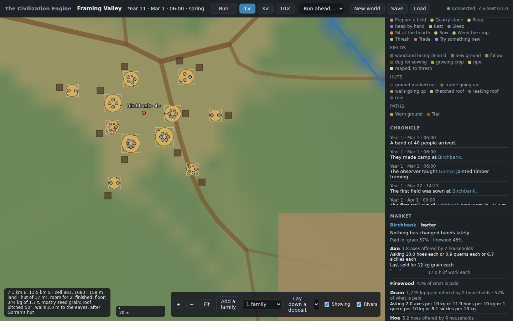<br><strong>M3b: Birchbank in its eleventh year, seed 4.</strong> Each hut stands beside the pit its daub was dug from. The readout shows a young couple's hut, built to their taste after the hut their families admired: "roof pitched 50°, walls 2.0 m to the eaves, after Gorran's hut". Five of the village's eleven buildings were built after an admired one. No frame building stands here: a hut is every household's cheapest home (see the M3b demo above).</p>

<p>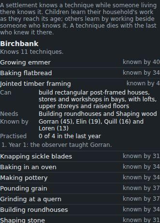<br><strong>A craft nobody practises.</strong> The observer taught Gorran jointed timber framing in the village's first year. Ten years on, three young people of his household have grown up knowing it, but nobody has built a frame, so nobody else has learnt it.</p>

<p>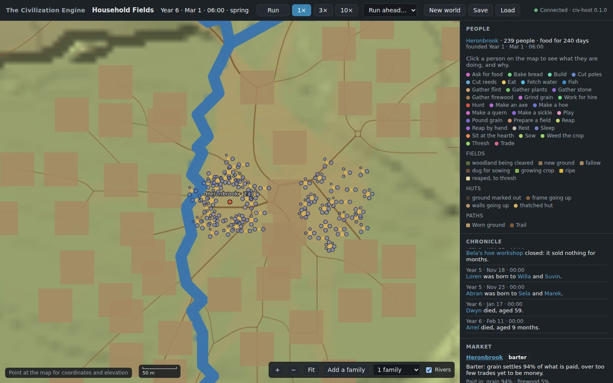<br><strong>M3a: a village of hundreds, seed 2.</strong> A band of 125 joined by twenty families made Heronbrook. Five years on, 239 people live here in 63 households, in two clusters by the river (the band's and the families'), with their fields around them. Grain settles 94% of what is paid, over too few trades yet to count as money. In every one of the demo's six runs of this seed, the sixth year's harvest came in some 40% short, and within two years everyone had left (see the M3a demo above).</p>

<table>
  <tr>
    <td width="50%">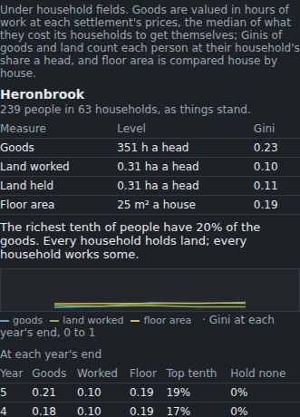<br><strong>Household fields, five years on</strong></td>
    <td width="50%">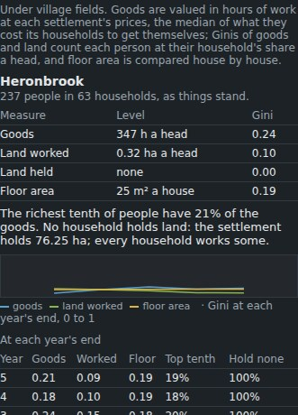<br><strong>Village fields, five years on</strong></td>
  </tr>
</table>

The same seed under the two regimes: the Gini of goods 0.23 against 0.24, of floor area 0.19 in both, 25 m² a house in both. Only who holds the land differs: every household, or the settlement with all 76 ha.

<p>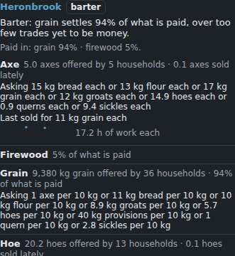<br><strong>Heronbrook's market:</strong> what its households offer and on what terms, in the goods they take.</p>

<p>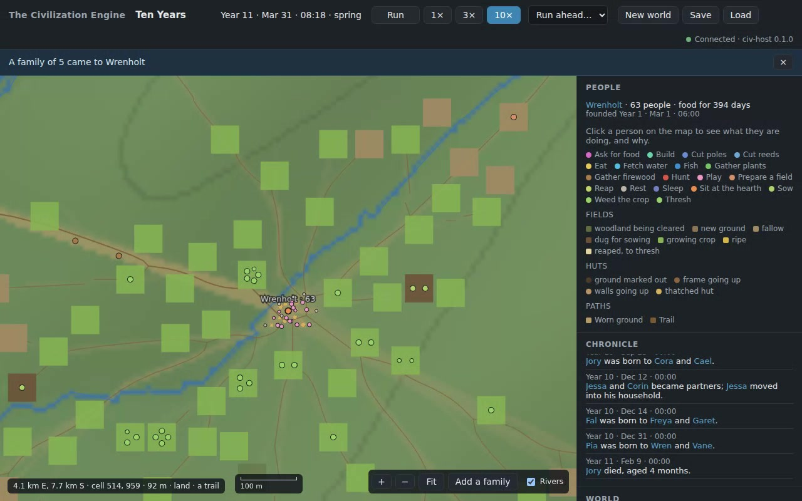<br><strong>M1: Wrenholt ten years on, seed 2.</strong> A band of 40 made camp here on 1 March of year 1. Ten springs later, 63 people live here, including a family the observer sent in the second year. They are out in the fields around the village, and trails run out to them. The chronicle records the year's births, a new couple and a child's death. The <a href="assets/m1/m1-demo.webm">M1 demo</a> (107 s) follows these ten years: it creates the world, watches the first morning, runs ahead a month and a year, sends the family, runs ahead to the tenth year (shown five times faster), then saves the world and loads it back.</p>

<p>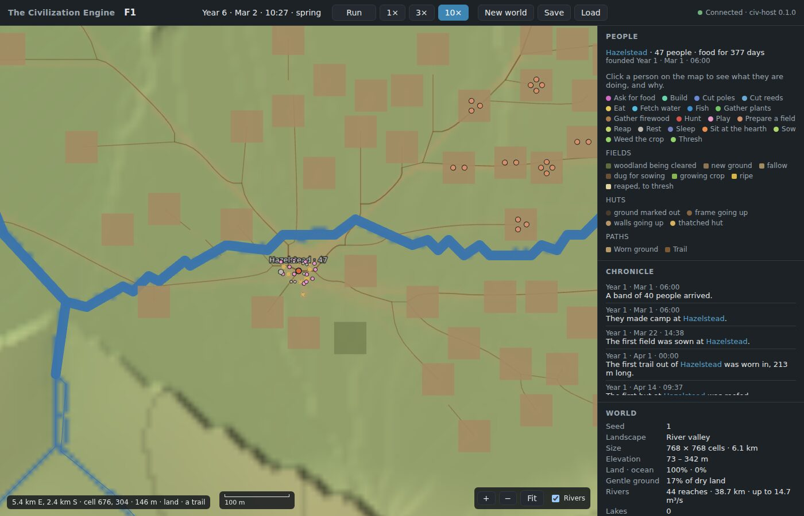<br><strong>M1 slice F: the paths of Hazelstead in its sixth March, seed 1.</strong> Five years of walking have worn trails from the village out to its fields across the valley. Nobody laid them out: they are where people walked most. The readout names a trail under the pointer, and the chronicle noted the first trail out in the band's first April. The fields lie fallow until sowing.</p>

<p>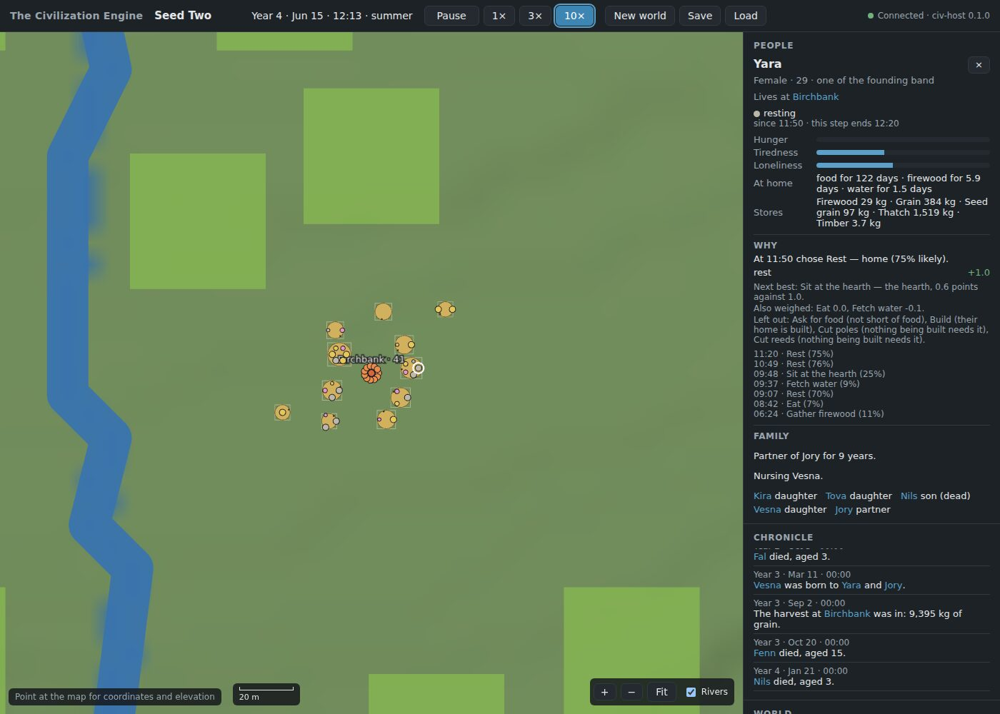<br><strong>M1 slice E: Birchbank in its fourth June, seed 2.</strong> Forty-one people live here under eleven roofs, and the emmer is growing. Yara came with the founding band. The inspector says she has been Jory's partner for nine years and is nursing Vesna, fifteen months old; her son Nils died in January, aged 3. The chronicle notes the village's births, deaths and harvests. Earlier entries tell of two young couples who set up households of their own.</p>

<table>
  <tr>
    <td width="50%">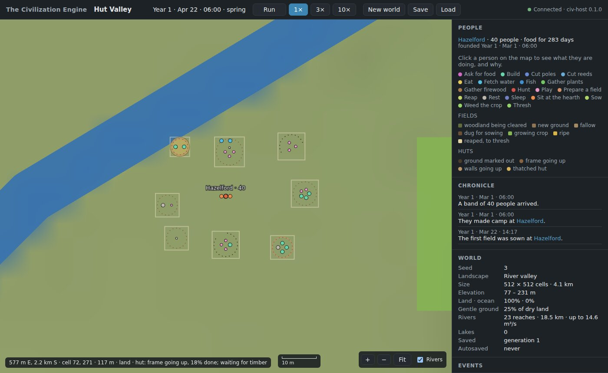<br><strong>M1 slice D: huts going up at Hazelford, 22 April, seed 3.</strong> Each plot is the square its hut's roof will cover. One hut is being thatched; the others show their postholes or posts. The readout names the hut under the pointer: its frame is 18% done and it waits for timber.</td>
    <td width="50%">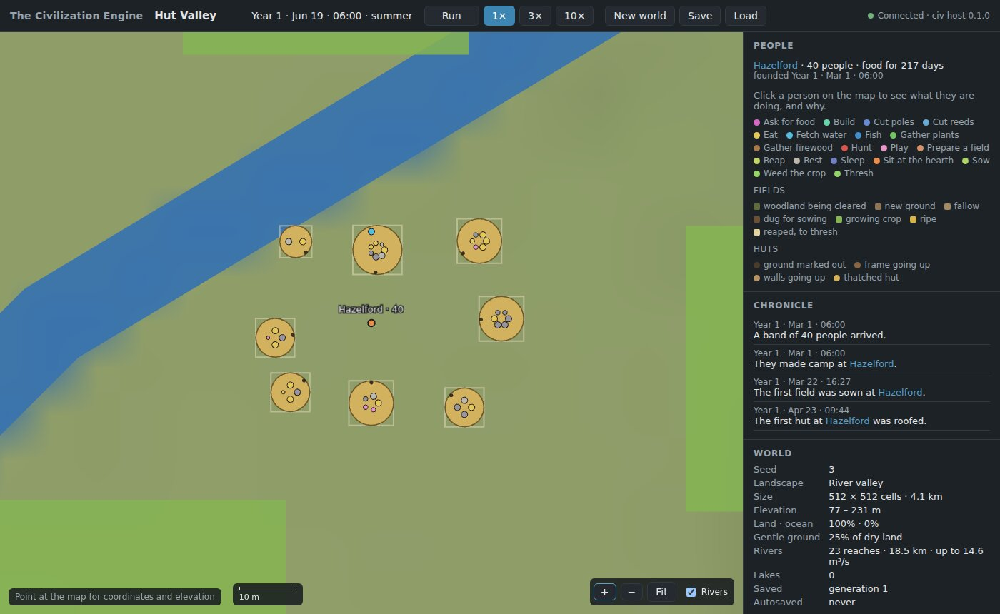<br><strong>Hazelford in June, from another run of the same seed.</strong> Every household is under a thatched roof, each hut sized for its household with its door toward the hearth. At dawn its people are still asleep inside.</td>
  </tr>
</table>

<p>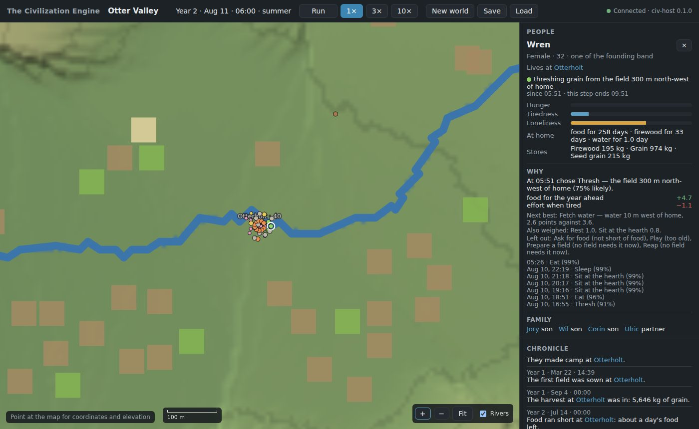<br><strong>M1 slice C: Otterholt's second harvest, seed 11.</strong> Most fields are reaped (brown), a few late-sown ones still grow (green) and one holds sheaves to thresh (pale). Wren threshes at home; her household keeps 974 kg of grain and 215 kg of seed. The chronicle notes the first sowing, the first harvest of 5,646 kg, and a short spell of hunger before the second.</p>

<p>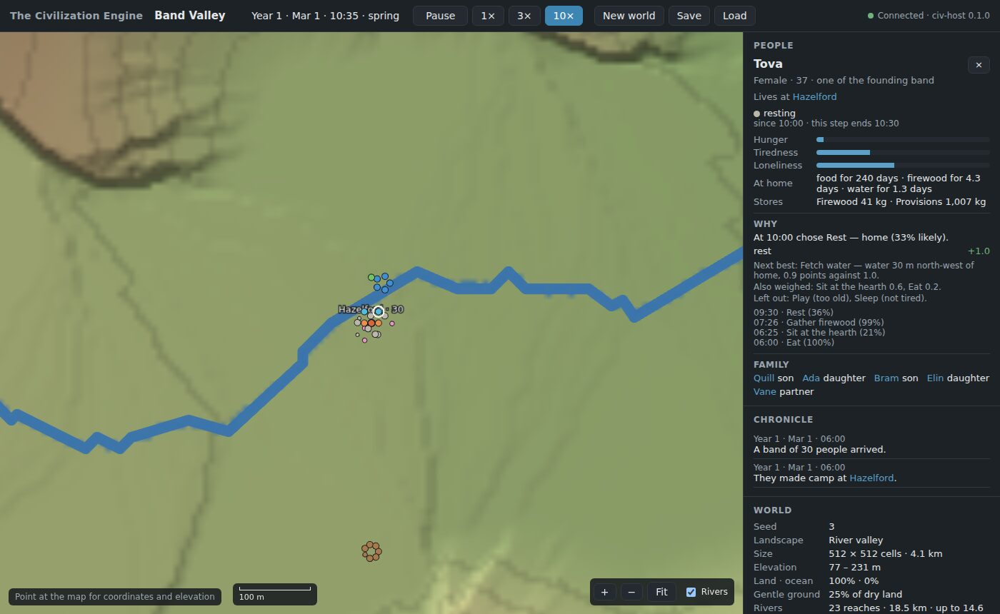<br><strong>M1 slices A and B: a band of 30 at Hazelford, seed 3.</strong> Dots are people coloured by activity; a firewood party works south of the camp. The inspector shows the household's days of food, firewood and water and what is in store, then the last decision's considerations, the next-best option and what was ruled out.</p>

The M0 screenshots below show the terrain alone. Recordings of the M0 end-to-end tests are in [`assets/m0/m0-demo.webm`](assets/m0/m0-demo.webm), which generates, explores, saves and loads a world, and [`assets/m0/m0-recovery.webm`](assets/m0/m0-recovery.webm), which recovers after the host is killed.

<table>
  <tr>
    <td width="50%">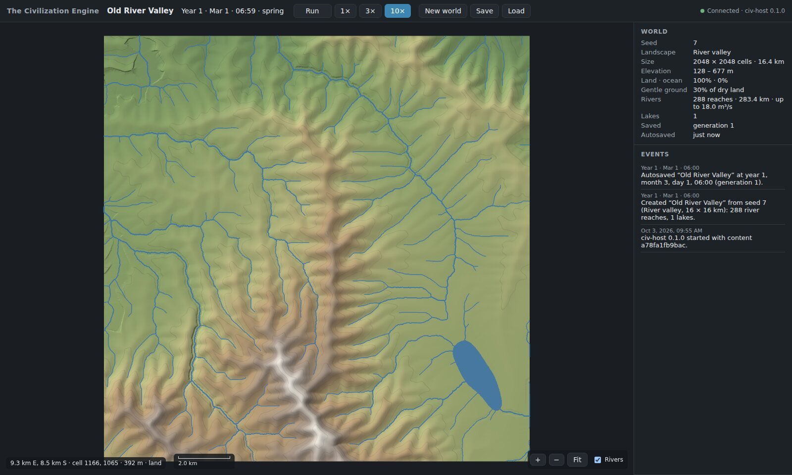<br><strong>A 16 km river valley from seed 7</strong></td>
    <td width="50%">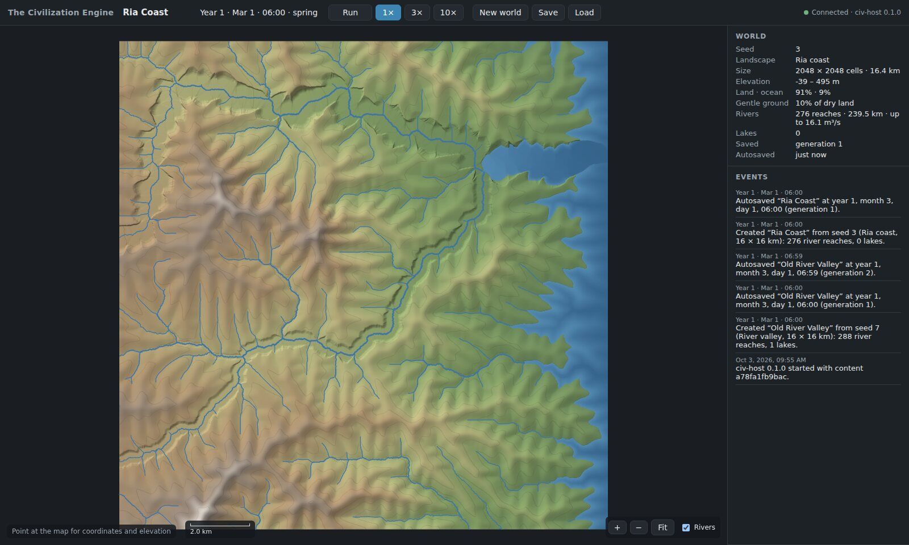<br><strong>The ria coast preset, seed 3</strong></td>
  </tr>
  <tr>
    <td width="50%">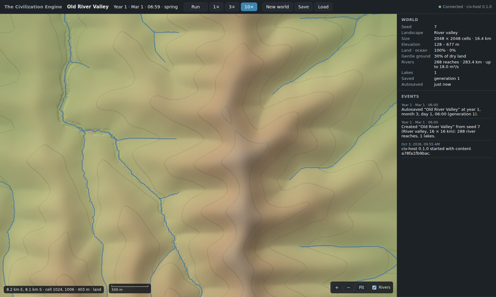<br><strong>Zoomed in to 8 m cells, with the coordinate readout</strong></td>
    <td width="50%"><br><strong>The save browser</strong></td>
  </tr>
</table>

## Visual previews

**Illustrative concept art, generated for this README.** These images communicate the intended scope across historical and modern settings. They are not screenshots or evidence of implemented simulation features.

<table>
  <tr>
    <td width="50%"><br><strong>Settlements and cities across history</strong></td>
    <td width="50%"><br><strong>Modern civilization and urban systems</strong></td>
  </tr>
</table>

## Simulation design

| System | Direction |
| --- | --- |
| People | Individuals with needs, routines, relationships, memory, and bounded decision-making |
| Settlements | Communities that choose where and how to grow, shaping neighborhoods and cities over time |
| Society | Governance, law, culture, religion, education, social groups, and conflict |
| Economy | Production, labor, property, markets, money, firms, trade, and public services |
| Technology | Knowledge and inventions that spread, change, and sometimes disappear |
| World | Terrain, climate, water, ecology, resources, hazards, and infrastructure |
| Observer | A detailed view into people, places, institutions, decisions, and the history they produce |

### Architecture

A data-oriented Rust kernel owns the world's state and its rules. Viewers only show that state and forward the player's requests. In M0 the viewer is a web observer served by a headless host over a versioned, schema-generated boundary. From M2, an Unreal Engine client will render the world through the same boundary. The kernel stays free of any Unreal dependency.

```
content/ (authored vocabulary) ──► civ-content ─┐
civ-core (ids, time, scheduler) ─► civ-world ───┼─► civ-sim (world state, saves, payloads) ─► civ-host ─► web observer
commons-wire, commons-persist (shared with other engines) ┘                                (CLI, WebSocket)   (PixiJS)
```

On Windows, run `tools\run.ps1` in PowerShell. The host opens the local observer at <http://127.0.0.1:7420/>. For development commands, tests and troubleshooting, see [AGENTS.md](AGENTS.md).

## Documentation

- [Development journal and technical guide](docs/development-journal/README.md)
- [Project plan and milestone decisions](PROJECT_PLAN.md)
- [Architecture decision records](decisions/README.md)
- [Research index: 170 topics across 16 domains](research/README.md)
- [Content authoring guide](content/README.md)
- [Web observer guide](web/README.md)

## License

No license has been added. Until one is chosen, the repository does not grant reuse or redistribution rights.
